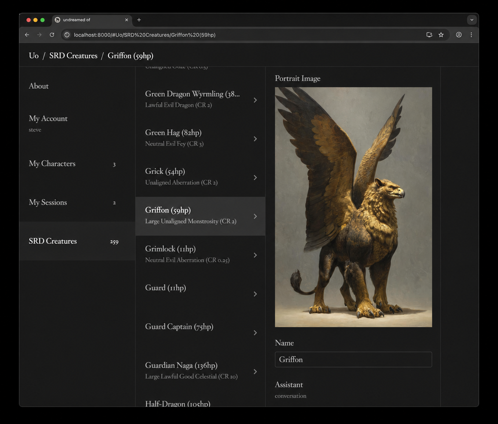

# Naked Objects

Closing the Usability Gap in Naked Objects

## Abstract

Also available as a [PDF](compiled/Closing_the_Usability_Gap_in_Naked_Objects.pdf).

The naked objects pattern proposed that user interfaces could be generated directly from domain models, eliminating bespoke UI development while guaranteeing consistency between interface and business logic. Twenty-five years later, this promise remains largely unfulfilled, not because automatic generation failed, but because the generated interfaces (generic forms, tables, and menus) lacked the spatial organization and navigational fluency users expect from modern applications.

We argue that the usability gap was not inevitable: the design space for presenting structured information is narrower than the software industry assumes, and a small set of composable primitives (tiles, tile stacks, and recursively nested master-detail views) covers it. The argument is grounded in HCI research on mental models, information foraging, and Gestalt principles of perceptual organization, which together explain why a deliberately constrained UI grammar turns uniformity into an asset rather than a constraint.

We present Strvct, an open-source JavaScript framework implementing this approach. Centralizing the model-to-view pipeline yields structural consequences (an AI-operable domain model, automatic responsive design, headless testability, and annotation-driven persistence with cloud sync) that conventional component frameworks must pay for per-screen. A production application built on Strvct, undreamedof.ai, comprises ~90 domain classes with roughly 90% auto-generated views; only three custom views were needed, all for inherently graphical components.

## 1. Introduction

Most application frameworks treat the user interface as a separate engineering problem from the domain model. Each screen must be designed, implemented, and maintained independently. Every new model class or schema change propagates into view code, form layouts, navigation logic, and responsive design. This duplication is not incidental; it is structural, and its cost grows linearly with the number of domain objects.

Naked objects [1] proposed a radical alternative: expose domain objects directly to users and generate the interface automatically. Developers write only the domain model; the UI follows from it. This also guarantees structural consistency: the interface always reflects the actual state and shape of the model, because there is no separate representation to fall out of sync.

The pattern was described by Pawson and Matthews in 2000 and has been implemented in several frameworks, most notably Apache Isis (now Apache Causeway) for Java [2]. These implementations demonstrated the core thesis: automatic UI generation from domain models is feasible and produces functionally complete interfaces. Yet adoption has remained confined to internal tools, administrative interfaces, and prototypes.

The reason is not technical but perceptual. The generated interfaces (generic forms for objects, tables for collections, menus for navigation) are correct and complete but *feel wrong*. They lack the spatial hierarchy, navigational depth, and responsive behavior that users have come to expect. They resemble database administration tools more than the applications people use daily. This usability gap, rather than any limitation of the underlying pattern, has prevented naked objects from reaching its potential.

Component frameworks (React, Vue, Svelte) attack the same cost problem from the opposite direction: rather than eliminating view code, they make it cheaper to write. Component libraries push this further. But the view tree still exists, must be authored, and must be kept in sync with the model. Adding a property still touches a form, a validator, a serializer, and a translation file. Naked objects, properly executed, eliminates the view tree as an authored artifact entirely. It is derived. That is the structural difference no component library closes.

This paper describes an approach to closing the usability gap. We argue that the design space for presenting structured information is narrower than it appears, identify a small set of composable primitives that covers it, and present a framework, Strvct, that demonstrates the approach in a production application.

The contributions are: (1) the *narrow design space* hypothesis: that informational UIs converge on a small set of spatial conventions, making uniform application of those conventions an asset rather than a constraint; (2) a small set of composable primitives (tiles, tile stacks, and recursively nested master-detail views) that we claim covers this space; (3) an annotation system in which independent framework layers (UI, persistence, sync, AI, i18n) read metadata from the same slot declarations without coordinating; (4) a working framework, Strvct, implementing the approach; (5) a production application, undreamedof.ai, in which roughly 90% of views across ~90 domain classes are auto-generated.

## 2. The Usability Gap

Prior naked objects implementations typically present each object as a form with fields for its properties, and collections as tables or lists. Navigation is handled through menus, links, or search. This strategy is functionally sufficient but creates four specific problems:

**Lack of spatial hierarchy.** Users expect spatial relationships to convey meaning: hierarchy expressed top-to-bottom, navigation depth expressed left-to-right, containment for ownership. Generic forms and tables flatten these relationships, requiring users to navigate through menus rather than perceiving structure visually.

**No viewport adaptation.** Modern applications invest heavily in responsive design: collapsing navigation, stacking layouts, hiding secondary content. Generic form-based interfaces either ignore viewport constraints entirely or implement ad-hoc responsive behavior that doesn't generalize across the domain model.

**Inconsistent navigation depth.** As users navigate deeper into an object hierarchy, form-based interfaces either replace the current view entirely (losing context) or open new windows (fragmenting context). Neither gives users a sense of where they are within the larger structure.

**No visual continuity.** Without a consistent spatial model, users cannot build a mental map of the application. Each navigation action feels like arriving at a new, disconnected screen rather than moving within a coherent space.

These problems are not inherent to the naked objects pattern. They are artifacts of a UI strategy (generic forms and tables) that prior implementations chose because it was simple and sufficient for their target audience. The question is whether a different strategy can retain the benefits of automatic generation while producing interfaces that meet the expectations set by modern hand-crafted applications.

## 3. A Narrow Design Space

Before proposing a solution, consider what those expectations entail. Our central hypothesis: *most variation between informational interfaces is accidental rather than essential*. The structural geometry of browsing, navigating, and editing data has converged on a small vocabulary, and most of what distinguishes one application from another is visual styling, not spatial logic.

When you survey informational interfaces across the applications where people spend most of their time, the same spatial conventions appear repeatedly: hierarchy expressed top-to-bottom, navigation depth expressed left-to-right, containment for ownership, and lists for collections. Consider four examples:

- **Email** (Gmail, Outlook): a vertical list of messages on the left, message content on the right. Selecting a message reveals its contents in a detail pane. Folders or labels provide a second level of hierarchy. The spatial metaphor is master-detail with optional grouping.

- **Facebook**: a vertical feed of posts, each expandable into comments and replies. Navigation between sections (feed, groups, marketplace) uses a sidebar list. Profile pages are vertical stacks of categorized content. The spatial metaphor is list-of-lists with drill-down.

- **Twitter/X**: a vertical timeline of posts. Selecting one reveals a thread, a vertical stack of replies. Navigation between timelines (home, explore, notifications) uses a sidebar. The spatial metaphor is master-detail where both master and detail are vertical lists.

- **Amazon**: a vertical list of search results, each clickable into a product detail page: a vertical stack of sections (images, description, reviews, related items). Category browsing uses a hierarchical sidebar. The spatial metaphor is master-detail with nested vertical stacks.

These are four different applications built by four different companies for four different purposes, yet they use the same underlying spatial logic.

This convergence is not coincidence; it is grounded in decades of HCI and cognitive science research.

**Mental models and spatial metaphors.** Users construct internal *mental models* of systems that are overwhelmingly spatial (Norman, 1988; Gentner & Stevens, 1983). They reason about digital information using the same primitives they use for physical environments: location, containment, proximity, and hierarchy. Tiles, stacks, and master-detail views directly support these metaphors.

**Information foraging and scanning patterns.** Eye-tracking research shows predictable Western reading behaviors: an F-pattern for text-heavy pages and a Z-pattern for mixed layouts (Nielsen, 2006; Pernice, 2017). Interfaces aligned with these patterns reduce cognitive load; those that fight them increase it. Our primitives are engineered to reinforce natural scanning order rather than fight it.

**Consistency and Gestalt principles.** Jakob Nielsen lists “Consistency and Standards” among the top usability heuristics (Nielsen, 1994). Gestalt laws of perceptual organization (proximity, similarity, closure, and common fate; Wertheimer, 1923; Koffka, 1935) explain why vertically stacked tiles and recursive nesting feel immediately coherent. By baking these laws into the architecture, consistency becomes a structural guarantee rather than an aspirational goal.

The design space is narrow because human cognition is narrow in how it organizes and navigates information; what feels like creative freedom in traditional UI design is often accidental complexity layered on these fundamental constraints. Bespoke UI developers are already converging on the same patterns, unconsciously and inconsistently: the variation between hand-crafted interfaces is largely superficial, with different visual styling, different spacing, and different component libraries sitting atop the same underlying spatial logic.

The practical consequence: if the design space is narrow, a framework that applies the conventions uniformly may produce interfaces that are not merely acceptable but *preferable* to a patchwork of bespoke screens, because users can rely on consistent navigation throughout. The framework's limitation (it cannot produce arbitrary layouts) is actually an advantage, because arbitrary layouts are precisely what creates inconsistency.

### Scope and Counterexamples

The narrow design space covers a large and important class of applications, but it is not universal. The following adversarial cases fall outside it:

- **Data visualizations and dashboards.** Charts, graphs, heatmaps, and interactive analytics require specialized rendering and direct-manipulation gestures that cannot be usefully derived from domain model structure alone.
- **Creative canvases and spatial editors.** Design tools (Figma, Miro), diagramming applications, CAD, and map editors, where objects have free-form 2D or 3D positioning.
- **Real-time media and games.** Video editors, 3D renderers, audio workstations, and games (as in our own case study, where dice rolling and the battle map required custom views).
- **Highly unusual workflows.** Interfaces that demand non-hierarchical navigation, complex state machines with many transient modes, or domain-specific interaction metaphors (e.g., timeline-based video editing or node-based programming).

In our production case study (§8), fewer than 10% of domain classes required custom view code (3 of ~90); the rest were generated automatically and felt natural to users. We believe this ratio is representative for many enterprise, productivity, and data-management applications, but we do not claim universality.

**Deliberate trade-off.** Refusing to support arbitrary layouts yields structural consequences a more general system loses: consistency, responsiveness, AI interoperability, and near-zero view-layer maintenance. Applications mostly inside the narrow space gain dramatically lower maintenance cost and higher consistency; those dominated by adversarial cases are better served by traditional component frameworks.

Future work could explore hybrid approaches (e.g., allowing selected custom view components inside an otherwise auto-generated tile/stack hierarchy) or expanding the primitive set in a disciplined way, but we have intentionally kept the core grammar minimal.

## 4. Approach: Composable UI Primitives

Our approach is to define a small set of composable UI primitives that embody the spatial conventions identified above. Each primitive handles one aspect of presentation; composed together, they cover the navigational and layout patterns found in typical informational applications.

The guiding principle is simplicity and power through conceptual unification: each primitive eliminates distinctions that conventional frameworks maintain separately:

| Concept | Unifies |
| --- | --- |
| Annotated slots | Properties, form fields, storage records, schema, translation keys, ARIA attributes |
| Tiles | Summary views, property editors, list items, navigation elements |
| Master-detail views | Menus, inspectors, drill-downs, settings panels, breadcrumbs, responsive layouts |
| Domain nodes | Objects, navigation hierarchy, persistence graph, AI-operable surface |

The sections below describe each primitive in detail.

### 4.1 Tiles

The fundamental unit of presentation is the **tile**: a view that presents a single domain object or a single property of a domain object.

**Summary tiles** present domain objects with a title, subtitle, and optional sidebars. They serve as the primary navigation element: selecting a summary tile reveals the object's contents in an adjacent detail area.

<div style="width: 100%; max-width: 100vw; overflow: hidden;">
  <div style="padding: 0.2em 0 0.5em; margin: 0; text-align: center;">
    Summary Tile
  </div>
  <object type="image/svg+xml" data="diagrams/svg/summary-tile.svg" style="display: block; margin: 0 auto; max-width: 400px; width: 80%;">[SVG diagram]</object>
</div>

**Property tiles** present individual properties as key-value pairs, with optional notes and validation errors. Specialized property tiles handle common types (strings, numbers, dates, images, booleans) with type-appropriate editing interactions.

<div style="width: 100%; max-width: 100vw; overflow: hidden;">
  <div style="padding: 0.2em 0 0.5em; margin: 0; text-align: center;">
    Property Tile
  </div>
  <object type="image/svg+xml" data="diagrams/svg/property-tile.svg" style="display: block; margin: 0 auto; max-width: 400px; width: 80%;">[SVG diagram]</object>
</div>

Tiles support gestures for direct manipulation: slide-to-delete, long-press reordering, and drag-and-drop between tile stacks, across browser windows, and to or from the desktop and other applications. Domain objects register which MIME types they accept, enabling type-safe import and export through standard drag interactions.

Tiles can be subclassed for domain-specific presentation, but the default tiles are designed to be sufficient for the majority of cases. The goal is to make custom tiles the exception, not the rule.

### 4.2 Tile Stacks

A **tile stack** is a scrollable, ordered sequence of tiles presenting the subnodes of a domain object. Tile stacks support flexible orientation (vertical or horizontal) and gestures for adding, removing, and reordering items.

<div style="width: 100%; max-width: 100vw; overflow: hidden;">
  <div style="padding: 0.2em 0 0.5em; margin: 0; text-align: center;">
    Tile Stack
  </div>
  <object type="image/svg+xml" data="diagrams/svg/tiles.svg" style="display: block; margin: 0 auto; max-width: 200px; width: 60%;">[SVG diagram]</object>
</div>

### 4.3 Master-Detail Views

A **master-detail view** pairs a tile stack (the master) with a detail area that presents the currently selected item. The detail area itself may contain another master-detail view, enabling arbitrarily deep navigation through recursive composition.

<div style="width: 100%; max-width: 100vw; overflow: hidden;">
  <div style="padding: 0.2em 0 0.5em; margin: 0; text-align: center;">
    Master-Detail View
  </div>
  <object type="image/svg+xml" data="diagrams/svg/master-detail.svg" style="display: block; margin: 0 auto; max-width: 400px; width: 80%;">[SVG diagram]</object>
</div>

Three features make this composition practical:

**Flexible orientation.** The detail area can be positioned to the right of or below the master, as specified by the domain object or overridden by the interface. This allows the same primitive to express both horizontal navigation (like a file manager) and vertical drill-down (like a settings panel).

<div style="width: 100%; max-width: 100vw; overflow: hidden;">
  <div style="padding: 0.2em 0 0.5em; margin: 0; text-align: center;">
    Master-Detail Orientations
  </div>
  <object type="image/svg+xml" data="diagrams/svg/orientations.svg" style="display: block; margin: 0 auto; max-width: 500px; width: 90%;">[SVG diagram]</object>
</div>

**Automatic collapsing.** When the viewport is too narrow to display the full chain of master-detail views, earlier columns automatically collapse. A breadcrumb bar tracks the navigation path and provides back-navigation. The same structure works on a wide desktop monitor and a narrow mobile screen without any per-object responsive design.

<div style="max-width: 600px; margin: 0 auto;">
  <div style="padding: 0.2em 0 0.5em; margin: 0; text-align: center;">
    Expanded
  </div>
  <object type="image/svg+xml" data="diagrams/svg/expanded.svg" style="display: block; width: 100%; height: auto;">[SVG diagram]</object>
</div>
<br>

<div style="max-width: 600px; margin: 0 auto;">
  <div style="padding: 0.2em 0 0.5em; margin: 0; text-align: center;">
    Collapsed
  </div>
  <object type="image/svg+xml" data="diagrams/svg/collapsed.svg" style="display: block; width: 100%; height: auto;">[SVG diagram]</object>
</div>
<br>

**Header and footer areas.** The master section supports optional header and footer views for features like search, message input, or group actions, allowing common interaction patterns to be expressed within the same compositional framework.

### 4.4 Composition

Nesting master-detail views with varying orientations produces navigation structures that match many common application patterns: Miller column file browsers, settings hierarchies, email clients, chat applications, inspector panels. These are not special cases implemented individually; they are natural compositions of the same three primitives.

<div style="display: flex; flex-wrap: wrap; justify-content: center; gap: 2%; width: 100%;">
  <div style="min-width: 150px; width: 30%; text-align: center;">
    <div style="padding: 0.2em 0 0.5em; margin: 0;">Vertical</div>
    <object type="image/svg+xml" data="diagrams/svg/vertical-hierarchical-miller-columns.svg" style="width: 100%; height: auto;">[SVG diagram]</object>
  </div>
  <div style="min-width: 150px; width: 30%; text-align: center;">
    <div style="padding: 0.2em 0 0.5em; margin: 0;">Horizontal</div>
    <object type="image/svg+xml" data="diagrams/svg/horizontal-hierarchical-miller-columns.svg" style="width: 100%; height: auto;">[SVG diagram]</object>
  </div>
  <div style="min-width: 150px; width: 30%; text-align: center;">
    <div style="padding: 0.2em 0 0.5em; margin: 0;">Hybrid</div>
    <object type="image/svg+xml" data="diagrams/svg/hybrid-hierarchical-miller-columns.svg" style="width: 100%; height: auto;">[SVG diagram]</object>
  </div>
</div>

This composability is the key insight. Rather than implementing a fixed set of application templates, the framework provides building blocks that compose to produce appropriate layouts for each part of the domain model. The Miller Column pattern [3] has been used since NeXTSTEP for file browsing; our contribution is making it recursive, orientation-flexible, and self-composing based on model annotations.

### 4.5 Examples

To illustrate, we decompose four widely-used applications into their constituent views:

<div style="display: flex; flex-wrap: wrap; justify-content: center; gap: 2%; width: 100%;">
  <div style="min-width: 300px; width: 48%; text-align: center;">
    <div style="padding: 0.2em 0 0.5em; margin: 0;">Email</div>
    <object type="image/svg+xml" data="diagrams/svg/gmail-composition.svg" style="width: 100%; height: auto;">[SVG diagram]</object>
  </div>
  <div style="min-width: 300px; width: 48%; text-align: center;">
    <div style="padding: 0.2em 0 0.5em; margin: 0;">Twitter/X</div>
    <object type="image/svg+xml" data="diagrams/svg/twitter-composition.svg" style="width: 100%; height: auto;">[SVG diagram]</object>
  </div>
  <div style="min-width: 300px; width: 48%; text-align: center;">
    <div style="padding: 0.2em 0 0.5em; margin: 0;">Facebook</div>
    <object type="image/svg+xml" data="diagrams/svg/facebook-composition.svg" style="width: 100%; height: auto;">[SVG diagram]</object>
  </div>
  <div style="min-width: 300px; width: 48%; text-align: center;">
    <div style="padding: 0.2em 0 0.5em; margin: 0;">Amazon</div>
    <object type="image/svg+xml" data="diagrams/svg/amazon-composition.svg" style="width: 100%; height: auto;">[SVG diagram]</object>
  </div>
</div>

These diagrams are not exact reproductions of each application's current interface; they are simplifications intended to capture the underlying structural form rather than every navigational element. Despite serving very different domains (communication, social media, microblogging, and e-commerce), all four decompose into the same small set of primitives: horizontal menus, vertical lists, and custom content views nested in master-detail relationships. Each is, at its core, a hierarchy of menus interleaved with browsable lists of content nodes and an inspector pane for the selected item, paired with a responsive layout strategy that decides what to show, hide, or collapse to make the best use of the viewport. The structural variation between them is minimal; the differences that users perceive are primarily visual styling and the domain-specific content view.

## 5. From Model to Interface

To make the "write the model, get the UI" claim concrete, consider a minimal domain class in Strvct:

```javascript
(class Character extends SvStorableNode {

    initPrototypeSlots () {
        {
            const slot = this.newSlot("name", "");
            slot.setSlotType("String");
            slot.setShouldStoreSlot(true);
            slot.setSyncsToView(true);
            slot.setCanEditInspection(true);
        }
        {
            const slot = this.newSlot("level", 1);
            slot.setSlotType("Number");
            slot.setShouldStoreSlot(true);
            slot.setSyncsToView(true);
        }
        {
            const slot = this.newSlot("inventory", null);
            slot.setFinalInitProto(Inventory);
            slot.setIsSubnodeField(true);
        }
    }

    initPrototype () {
        this.setShouldStore(true);
    }

    subtitle () {
        return "Level " + this.level();
    }

}.initThisClass());
```

This definition contains no UI code, no form layouts, no navigation logic, and no serialization code. Yet it produces:

- A **summary tile** displaying the character's name as a title and "Level 1" as a subtitle
- **Property tiles** for `name` (editable string field) and `level` (editable number field), with appropriate input types
- A **navigable field** for `inventory` that, when selected, opens a new master-detail view showing the inventory's contents
- **Automatic persistence** to IndexedDB, with dirty tracking and transactional commits
- **Bidirectional synchronization** between model and view: editing a field updates the model; programmatic model changes update the view
- **Automatic translation** of field labels and values when internationalization is active

The slot annotations (`setShouldStoreSlot`, `setSyncsToView`, `setCanEditInspection`, `setIsSubnodeField`) are the bridge between the domain model and the framework's automatic behaviors. Each annotation controls one aspect of the object's lifecycle; together, they provide enough information for the UI, storage, and synchronization layers to operate without additional code.

The following screenshot shows the Strvct framework as used in undreamedof.ai, an AI-powered virtual tabletop for tabletop roleplaying games. The interface (including character sheets, campaign hierarchies, session management, and settings panels) is generated from domain model annotations. No bespoke layout code was written for any of the screens shown.

<a href="figures/GriffinScreenshot.png" target="_blank"></a>

## 6. Architecture

Strvct is implemented as a client-side JavaScript framework. Applications run as single-page apps in the browser, making heavy use of client-side persistent storage, both for caching code and resources via a content-addressable build system, and for maintaining a persistent object database of application state in IndexedDB.

An important architectural distinction: Strvct does not compile or pre-render user interfaces. There is no build step that produces a view tree, no template system, and no static component hierarchy. Views are instantiated lazily at runtime: only when the user navigates to a node in the object graph. Each navigation step inspects the target node's class and slot annotations, discovers or creates an appropriate view, and binds it to the node for live bidirectional synchronization. Once created, a view persists as long as its node remains visible, staying in sync with the model through the notification system. The result is closer to a live object browser than a conventional render pipeline: the UI that exists at any moment is determined by the user's current navigation path through the object graph, and it responds immediately to changes in the underlying model.

### 6.1 Domain Model

The domain model is a graph of objects inheriting from a common base class. Each object has properties declared as *slots* with annotations, actions exposed as methods, a `subnodes` array of child objects, a `parentNode` reference, and a unique persistent identifier.

The model is fully independent of the UI layer. Model objects hold no references to views and communicate outward solely by posting notifications. This allows the same model code to run headlessly in Node.js for testing or server-side processing.

### 6.2 The Annotation Bridge

The slot system is what makes automatic UI and storage possible. Rather than using raw instance variables, properties carry metadata annotations that each framework layer consults independently:

- **Type**: selects the appropriate property tile and enables runtime type checking (every generated setter validates its argument against the declared type, catching type errors at the point of assignment rather than at compile time)
- **Persistence**: includes the slot in storage records
- **View synchronization**: triggers view updates when the value changes
- **Subnode relationship**: controls whether the value appears in the object's navigable hierarchy
- **Editability**: determines whether the property can be modified through the UI
- **Auto-initialization**: specifies a class to instantiate if no value was loaded from storage
- **Translation context**: provides semantic context for AI-powered translation

No single annotation knows about the others. The UI layer reads type and editability; the storage layer reads persistence; the synchronization layer reads sync flags. This separation means new layers can be added (internationalization, cloud sync, schema generation) without modifying existing annotations or the domain model itself.

### 6.3 Storage

Persistence is annotation-driven. The persistence layer monitors slot mutations, batches dirty objects at the end of each event loop into atomic transactions, and commits them to IndexedDB. On load, stored records are deserialized back into live object instances with relationships re-established.

A separate content-addressable blob store handles large binary data using SHA-256 hashes as keys, providing automatic deduplication. Objects store hash references rather than blob data directly.

Automatic garbage collection walks the stored object graph from the root; unreachable objects are removed.

### 6.4 Synchronization

Model and view layers communicate through a deferred, deduplicated notification system. When a model property changes, a notification is posted; observing views schedule a sync pass. Multiple changes within a single event loop are coalesced. Bidirectional sync stops automatically when values converge, preventing infinite loops. Observations use weak references, so garbage collection of either party automatically cleans up subscriptions.

## 7. Structural Consequences

When the framework controls the entire pipeline from model annotation to rendered view, capabilities that would otherwise cost per-component effort fall out of the architecture. The capabilities below are not surprises; they are downstream consequences of one structural fact: the framework has complete knowledge of the domain model and controls the single point where model data flows to the UI. Some are demonstrated in the production case study; others are architectural affordances, and we mark these explicitly rather than claim them as measured outcomes.

### 7.1 AI-Operable Domain Model

The same annotations that drive UI generation make the domain model legible and operable to AI agents. The original naked objects pattern eliminated the translation layer between model and UI; the same annotations now eliminate it between model and AI.

A schema for any object is derived from its slot metadata. Edits are expressed as JSON patches against that schema, validated through the same setters and type checks that govern human edits. A single pair of tools, *schema-fetch* and *apply-patch*, covers the entire domain regardless of the number of editable classes. Rejected patches carry the schema of the offending slot in the rejection payload, turning the type system into the agent's error-recovery channel: the agent self-corrects without re-fetching context.

For example, an AI assistant in undreamedof.ai can be told "increase the barbarian's strength by 2 and add a healing potion to their inventory." The agent fetches the character schema, constructs a patch, and applies it; validation feedback flows back through the same code path a human edit would take, and the change propagates through the same notification pipeline.

This contrasts with the prevailing pattern for AI tool use (function calling, Model Context Protocol, OpenAPI tool specs), where each editable surface requires a hand-authored tool, schema document, and error path, and the surface area grows linearly with the model. Here it is constant.

Characters, campaigns, and sessions are edited interchangeably by users (through generated tiles) and by AI assistants (through patch tools). New domain classes are AI-operable the moment they are declared.

### 7.2 Automatic Responsive Design

Because layout flows from model annotations rather than screen-specific CSS, the interface adapts to viewport size without per-view breakpoints. The recursive master-detail chain collapses when the viewport narrows, a breadcrumb bar preserves the navigation path, and the same composition scales from desktop to mobile with no per-screen responsive code. Responsive behavior is paid once at the primitive level, not per screen.

### 7.3 Accessibility as an Architectural Affordance

Because every interactive surface is generated from the same few primitives, accessibility is paid once at the primitive level rather than per screen. Focus order, keyboard traversal, drill-in, and back-out belong to tiles and tile stacks; the slot metadata that drives type checking can also generate ARIA roles and constraints; the node hierarchy supplies landmarks and breadcrumb structure. In a conventional framework, accessibility is a per-component obligation that scales with screen count and routinely lapses; here it cannot lapse selectively. Fixing it once fixes it everywhere. We have not validated the resulting interface against the full WCAG checklist or with screen-reader users, and report this as an architectural property rather than a measured outcome.

### 7.4 Transparent Internationalization

All UI text flows from slot annotations through a single rendering pipeline, so translation is injected at the model-to-view boundary without per-component translation calls or extraction tools; new classes are translatable by default. Centralization also makes AI-powered translation tractable: the framework enumerates translatable strings by walking class prototypes, and slot-level context annotations travel with each string to give the translator domain-appropriate terminology. Adding a language becomes a configuration change rather than a translation project. As with accessibility, full multi-language deployment and right-to-left layouts have not yet been validated in production; the architectural surface exists.

### 7.5 Transparent Persistence and Cloud Sync

Because the framework owns the complete object graph and understands its structure through annotations, persistence splits transparently into two strategies: a synchronous object pool for the model graph, so the UI is immediately responsive, and an asynchronous content-addressable blob store for large binary resources, so they never block rendering. The same structural knowledge enables transparent cloud synchronization: the framework knows what changed, which blobs are referenced, and how to reconcile state. The developer annotates what should persist; the framework decides how and when.

### 7.6 Content-Addressable Resource Loading

The build system produces a content-addressable bundle keyed by content hash. Unchanged resources are never re-downloaded across deployments, and identical content across paths is stored only once: caching granularity that path-based bundlers cannot achieve. End-to-end control of the resource pipeline is the same structural fact that drives the other consequences in this section.

### 7.7 Built-in Inspector and Developer Mode

Because every node carries enough slot metadata to drive its own UI, the same metadata also drives a generic inspector (a view that exposes any node's slots directly as editable fields, reachable on any tile through a single modifier-click). A complementary developer-mode toggle lets applications reveal subnodes normally hidden from end users, so the same navigation pipeline serves as a debug surface. In a conventional framework, debug tooling means custom inspectors per type and a parallel description of model shape, growing linearly with the model. Here, it is a free consequence of the model-to-view pipeline already covering every object.

### 7.8 Cross-Window and Cross-App Drag-and-Drop

Because every tile is generated from the same view classes, drag-and-drop works uniformly across the application in two modes that share the same gesture. A **copy** drag serializes the source node to JSON (with its sub-object pool inlined) and delivers it via the declared MIME types, so it extends naturally across browser windows, to and from the desktop, and to and from other applications that exchange those types. A **reference** drag transfers a persistent node UUID for moving or linking within the application without copying contents. Both modes are type-safe: the receiving side validates against the same slot metadata that drives form validation and AI patches. In a conventional framework, drag interop requires per-class handlers, per-screen serialization formats, and ad-hoc validation on receipt, and the cost scales with the number of draggable objects; here it is free at the primitive level. (Cross-window reference drags, where a second client resolves the UUID against shared state, are a natural extension but are not yet implemented.)

### 7.9 Headless Execution and Testability

Because model classes hold no references to views or browser globals, the same domain code runs unchanged under Node.js. Tests instantiate the model, drive it through action methods, and assert against slot values without a DOM. The notification system, persistence, and patch validation all operate without rendering, so behaviors that would normally require browser automation against a real DOM reduce to direct model assertions. The model/view separation that makes auto-generation possible is the same separation that makes the model headlessly executable: one architectural choice serves both ends.

## 8. Case Study: undreamedof.ai

Strvct has been used to build undreamedof.ai, an AI-powered virtual tabletop for Dungeons & Dragons and other tabletop roleplaying games. The breakdown by subsystem:

| Subsystem | Domain classes | Custom views |
| --- | ---: | ---: |
| Character system | ~30 | 0 |
| Campaign system | ~20 | 1 (map) |
| Session system | ~25 | 2 (chat, 3D dice) |
| AI integration | ~15 | 0 |
| **Total** | **~90** | **3** |

Fewer than 10% of classes required custom view code; the remainder (character sheets, campaign hierarchies, settings panels, administrative interfaces) use auto-generated tiles and master-detail views exclusively. The domain is non-trivial: character sheets have deeply nested hierarchies (character → ability scores → individual scores → modifiers), campaigns contain recursive location trees, and the session system maintains real-time state across multiple connected clients. The default primitives produce navigable, usable interfaces throughout.

**Scenario: AI-driven character creation.** A user asks an AI assistant to populate a character sheet. The assistant calls the same patch tools used internally; the same setters validate; the UI updates through the same notification system used for direct edits. Adding a new character property requires a single slot declaration; the UI, the AI tool surface, the persistence layer, and the translation enumeration all pick it up without further code. In a component framework, the same change would touch the model, a form component, an AI tool spec, and a serializer.

The custom views that were needed fall into the category identified in §3 as outside the narrow design space: a chat interface, a 3D dice roller, and a map view, all inherently graphical, domain-specific components that cannot be derived from model annotations. Their existence does not undermine the approach; it confirms that the boundary between auto-generated and bespoke views falls where predicted.

This is an existence proof, not generalization: one application, one primary developer. The claim it supports is feasibility, not optimality.

## 9. Related Work

**Naked objects implementations.** Apache Isis (now Apache Causeway) [2] is the most mature naked objects framework, providing automatic UI generation for Java domain models with both a web UI (Wicket viewer) and a REST API. JMatter [4] implemented naked objects for Java Swing. Both use form-and-table UI strategies and target enterprise/administrative use cases. Strvct differs in its UI strategy (composable spatial primitives rather than forms and tables) and its target (end-user applications rather than internal tools).

**Model-driven UI generation.** The broader field of model-driven development has produced approaches like IFML [5] (Interaction Flow Modeling Language) and UsiXML, which use abstract UI models to generate interfaces. These typically require separate UI models in addition to domain models, a layer of specification that naked objects explicitly eliminates. Strvct's approach is closer to naked objects in that the domain model itself, annotated with metadata, is the only specification needed.

**Miller Columns.** The column-based navigation pattern was introduced in NeXTSTEP and popularized by macOS Finder [3]. It provides spatial continuity when browsing hierarchical data. Strvct extends this pattern by making it recursive (columns can nest vertically or horizontally), orientation-flexible (each level can choose its own orientation), and self-composing (the layout is determined by model annotations rather than application code).

**Component frameworks.** The dominant approach to modern UI development (React, Vue, Svelte) addresses the same cost problem as low-code, but at a different layer: rather than eliminating view code, they make it cheaper to write. Component libraries (shadcn, MUI, Ant Design) reduce per-screen effort further by providing reusable building blocks. But the view tree still exists, must be authored, and must be kept in sync with the model. Adding a property still requires editing a form component, a validator, a serializer, and possibly a translation file. Naked objects, properly executed, eliminates the view tree as an authored artifact entirely. It is derived. This is the structural difference no component library closes.

**Low-code and no-code platforms.** Modern low-code platforms (Retool, Appsmith, OutSystems) aim to reduce UI development cost through visual builders and pre-built components. They approach the same problem as naked objects, reducing the cost of UI development, but from the opposite direction: rather than eliminating bespoke UI, they make bespoke UI faster to produce. The result is still a collection of individually designed screens that must be maintained as the data model evolves. Naked objects eliminates this maintenance cost entirely.

**AI-generated UI.** Large language models can now generate UI code from natural language descriptions. This automates the *creation* of bespoke interfaces but does not address their *maintenance*. Each generated screen is still a separate artifact that must be updated when the model changes. Naked objects is a fundamentally different approach: rather than automating the production of bespoke UIs, it eliminates the need for them.

## 10. Discussion

### The Crossover Point

Hand-crafted interfaces may appear more polished early in an application's life, when the number of screens is small and each can receive individual design attention. But as the domain model grows, the cost of maintaining bespoke screens grows with it, while inconsistencies accumulate. At some point (the crossover point), a consistent, automatically generated interface produces a better user experience than a patchwork of hand-crafted screens, because the user can rely on uniform navigation throughout the application.

The composable primitive approach shifts this crossover point earlier by improving the quality of the generated interface. The undreamedof.ai case study suggests the crossover may occur sooner than expected: at ~90 domain classes, auto-generated views were not merely acceptable but preferred for 90% of the interface, because they provided consistent navigation and interaction patterns that would have been difficult to maintain across hand-crafted screens.

### Strengths

The approach is strongest in domains where the model itself is the volatile, high-value artifact, where requirements change frequently and the cost of keeping UI, storage, and synchronization in sync with a shifting model is the main engineering bottleneck. Because a model change propagates automatically to the UI, persistence, cloud sync, AI integration, and internationalization, the iteration cycle from "requirement changed" to "working software" is compressed to the time it takes to modify a class definition. Adding a property, restructuring a hierarchy, or introducing a new entity requires no corresponding changes to view code, form layouts, serialization logic, or API schemas.

This makes the approach particularly suited to exploratory or fast-evolving applications: tools for analysis, research, operations, or any domain where the data model is expected to grow and change throughout the application's life. The framework's headless execution capability reinforces this: the same model that drives the UI can be tested, simulated, or batch-processed in Node.js without any browser dependency, enabling rapid validation of model changes before they reach users.

### Limitations

*Scope.* The composable primitive approach is suited to informational and navigational interfaces: browsing, editing, and managing structured data. Inherently graphical interfaces (data visualizations, design canvases, game renderers, timeline editors) require domain-specific rendering and fall outside the auto-generation pipeline. Strvct supports custom view classes for these, but each such view is a return to the costs the approach was meant to eliminate.

*Locale.* The spatial conventions we rely on reflect Western reading order. Right-to-left layouts are within the framework's flexbox-based rendering but have not been validated end-to-end.

*Performance.* Lazy view instantiation keeps the initial UI cheap, but very large collections (10⁴+ tiles in one stack) have not been stress-tested. The notification-and-sync model is built for graph-shaped UIs with modest fan-out, not stream-shaped UIs with high-volume updates.

*Tooling and ecosystem.* The framework forgoes the standard JavaScript module ecosystem in favor of a custom content-addressable resource loader. This is what enables hash-based caching and the centralized model-to-view pipeline, but it cuts the framework off from the React/Vue tooling commons: IDE component support, type-checked component props, hot reload, and the component-library ecosystem. Debugging dynamically evaluated code requires a sourceURL discipline rather than standard source maps. The trade is deliberate but real.

*Single-application evidence.* The case study is one application by one primary developer. Whether the approach scales to multi-team development, third-party plugins, or large existing codebases is open.

*Server-side compute and concurrency.* Strvct runs entirely client-side, with IndexedDB persistence and optional cloud sync. This produces excellent offline operation and snappy local interactions, but constrains use cases that require very large datasets, heavy server-side computation, or strict multi-user concurrency control.

*External validation.* Accessibility, internationalization, and mobile experience are architecturally supported but have not undergone external audits, large-scale user studies, or production deployment beyond the primary application.

### Future Directions

*Hybrid view composition.* Allowing custom view components to participate in the auto-generated tile/stack hierarchy would close the gap for the adversarial cases of §3: embedding a chart, a canvas, or a 3D viewport at a known node in the navigation tree without losing the structural guarantees of the surrounding interface.

*Server-side execution variants.* Pairing Strvct's headless mode with a server-side coordinator could support workloads (large datasets, heavy compute, strict multi-user concurrency) that exceed pure-client constraints, while keeping the same model and annotations as the source of truth.

*Empirical studies.* Controlled comparisons against component-based frameworks, measuring mental-model formation, task completion time, and maintenance cost as the model evolves, would replace the existence proof in §8 with quantitative evidence.

*Disciplined primitive expansion.* Adding primitives for patterns the current set does not cover (timelines, graphs, free-form 2D positions) while preserving the narrow-design-space property: each new primitive should express a generalizable spatial pattern rather than a one-off layout.

## 11. Conclusion

The naked objects pattern has offered a compelling proposition for twenty-five years: write the domain model, and the rest follows. Its limited adoption is not a failure of this proposition but of the UI strategies prior implementations chose. Generic forms and tables were sufficient for internal tools but never met the expectations of modern consumer software.

The gap is closable because the design space is narrow. A small set of composable primitives (tiles, tile stacks, and recursively nested master-detail views) covers the navigational and editing patterns shared by most informational applications, and the same annotation system that drives the UI drives persistence, synchronization, AI tool surfaces, and translation without per-layer coordination. Strvct demonstrates this in a production application of ~90 domain classes with roughly 90% of views auto-generated and custom views only where the narrow-space hypothesis predicts.

We close with a prediction. The pressure that may finally push naked objects past its twenty-five-year stall is not aesthetic but economic. As AI agents become routine co-editors of application state, the cost of keeping a bespoke UI synchronized with a model that an LLM can rewrite at any moment will exceed the cost of generating the UI from the model in the first place. The applications that survive this transition will be the ones whose UI is a projection of their model, not an authored artifact running alongside it.

## References

[1] Pawson, R., & Matthews, R. (2002). *Naked Objects.* Wiley. See also Pawson, R. (2004). *Naked Objects.* PhD Thesis, Trinity College, Dublin.

[2] Apache Software Foundation. *Apache Causeway* (formerly Apache Isis). https://causeway.apache.org/

[3] Becker, N. (2005). Miller Columns. Wikipedia. https://en.wikipedia.org/wiki/Miller_columns

[4] Arteaga, J. M. *JMatter: A Naked Objects Framework for Java Swing.* http://jmatter.org/

[5] Brambilla, M., & Fraternali, P. (2014). Interaction Flow Modeling Language. In *Proceedings of the 23rd International Conference on World Wide Web (WWW '14 Companion).* ACM.
