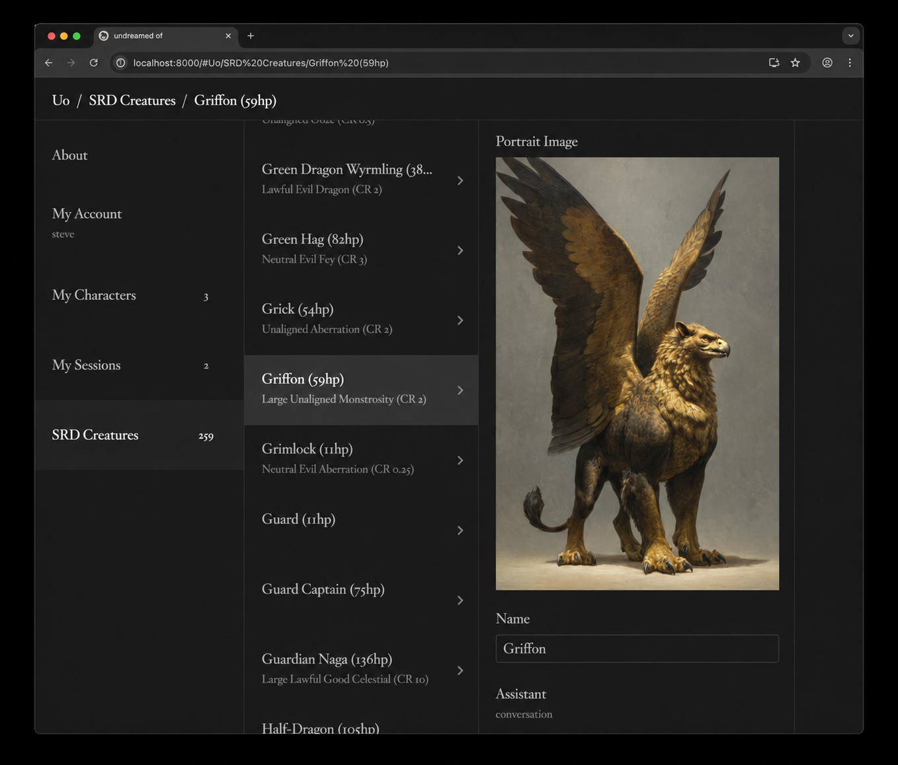

# Naked Objects

From Domain Models to Complete Applications

## Abstract

Also available as a [PDF](compiled/Closing_the_Usability_Gap_in_Naked_Objects.pdf).

The naked objects pattern promised to derive applications directly from domain models. Instead of maintaining a model, component tree, form schema, persistence mapping, API schema, navigation graph, and agent tool surface as separate descriptions of approximately the same facts, the developer would describe the domain once and let the runtime project it into each required form.

That promise was technically demonstrated but rarely made attractive. Earlier naked-objects systems typically rendered objects as forms and collections as tables, producing complete administrative interfaces without producing a convincing general interaction model. The problem was not derivation. It was the limited grammar into which the model was derived.

This paper proposes a stronger account of that grammar. Most structured-information interfaces consist primarily of two operations:

1. **traversing relationships among domain objects**, and
2. **projecting collections along a small number of semantic dimensions**.

Strvct implements the first operation through recursively composed, orientation-flexible master-detail views generated from the object graph. Tiles and tile stacks provide a uniform summary, editing, and navigation surface; Miller-column-style recursion preserves context at arbitrary depth and collapses automatically on narrow viewports. They already cover recursive hierarchy, ordered lists, and feed-like rich-item sequences. We argue that inline detail composition, per-context child ordering, and cross-sibling alignment may extend the same recursion to trees, grouped lists, kanban boards, tables, and basic spreadsheets. This leaves value-to-space mapping—the placement or extent of objects according to numeric, temporal, or spatial values—as the clearest distinct projection family.

The resulting boundary is sharper than “generated UI versus custom UI.” Ordinary information management belongs in the generated grammar. A custom view is appropriate when spatial representation itself carries irreducible domain meaning: a code editor, map, chart, waveform, canvas, 3D scene, or game surface.

We present Strvct, an open-source JavaScript framework built on this model-first architecture. Centralizing the model-to-view pipeline also yields capabilities that component frameworks usually pay for repeatedly: automatic responsive behavior, headless execution, annotation-driven persistence, cloud synchronization, inspection, accessibility hooks, internationalization, and AI operation. The same annotations that generate the human interface expose a constant-size agent tool surface that does not grow with the number of domain classes. A production application, undreamedof.ai, comprises roughly 90 domain classes with about 90% framework-generated views; its remaining custom views are inherently graphical.

## 1. Introduction

Most application frameworks treat the user interface as a separate engineering problem from the domain model. Each screen is designed, implemented, and maintained as its own artifact. Every new entity or property can propagate into component code, form layouts, validation, serialization, navigation, responsive rules, accessibility metadata, localization, and agent tools. The duplication is structural, not incidental, and its coordination cost grows with the model.

Naked objects [1] proposed a different path: expose domain objects directly to users and generate the interface automatically. Developers write only the domain model; the UI follows. Consistency is guaranteed, because there is no separate representation to fall out of sync — the interface always reflects the model's actual state and shape.

Pawson and Matthews described the pattern in 2002 [1]. Several frameworks have implemented it, most notably Apache Isis (now Apache Causeway) for Java [2]. These implementations proved the core thesis: automatic UI generation from domain models is feasible and produces functionally complete interfaces. Yet adoption stayed confined to internal tools, administrative interfaces, and prototypes.

The failure was not merely visual polish. Earlier systems had no sufficiently expressive interaction grammar. Generic forms answer “what properties does this object have?” but not “where am I in the domain?”, “what is this object related to?”, or “how should I understand this collection?” A table is suitable for a ledger and poor for a media library; a list is suitable for search results and poor for a project pipeline. Treating every collection alike discards semantics the model often already contains.

Component frameworks (React, Vue, Svelte) attack the same cost from the opposite direction: rather than eliminating view code, they make it cheaper to write. Component libraries push that further. But the view tree still exists, must be authored, and must be kept in sync with the model. Adding a property still touches a form, a validator, a serializer, and a translation file. Naked objects, done well, eliminates the view tree as an authored artifact. The view is derived. No component library closes that gap.

This paper describes how to close that gap without returning to hand-authored screens. We argue that the design space for structured-information applications is narrow in a specific sense: most interaction is object-graph traversal plus collection projection. The vocabulary is richer than forms and tables, but much smaller and more semantic than a general component library.

The contributions are:

1. A **two-part grammar for structured-information UI**: relationship traversal through the domain graph, and semantic projection of collections.
2. The **recursive, orientation-flexible, generated master-detail view** as the implemented traversal primitive. Miller columns have navigated hierarchies since NeXTSTEP; Strvct makes them recursive, orientation-flexible, auto-collapsing, and generated by default.
3. A **recursive collection-composition hypothesis** in which familiar forms reduce to placement policies over the existing object graph. Inline versus next-column detail, per-level orientation, dynamic child selection and ordering, and shared alignment may cover trees, grouped lists, kanban boards, tables, and basic spreadsheets without peer widget classes.
4. An annotation system in which independent framework layers—UI, persistence, synchronization, AI, accessibility, and internationalization—read metadata from the same slot declarations without coordinating.
5. A **natively AI-operable domain model** as a demonstrated consequence of that annotation system: a single pair of tools covers every editable class, so the agent-facing tool surface is constant in the size of the model rather than growing linearly with it.
6. A working framework and production application demonstrating the feasibility of the implemented traversal grammar, while identifying inline composition, runtime node-built objects, and value-to-space projection as testable directions rather than completed results.

## 2. The Usability Gap

Prior naked objects implementations present each object as a form of property fields and each collection as a table or list, with navigation through menus, links, or search. This is functionally sufficient but creates four specific problems.

**Lack of spatial hierarchy.** Users expect spatial relationships to carry meaning: hierarchy top-to-bottom, navigation depth left-to-right, containment for ownership. Generic forms and tables flatten these relationships. Users must navigate menus instead of perceiving structure.

**No viewport adaptation.** Modern applications invest heavily in responsive design: collapsing navigation, stacking layouts, hiding secondary content. Form-based interfaces either ignore the viewport or bolt on ad-hoc responsive behavior that does not generalize across the model.

**Inconsistent navigation depth.** As users go deeper into an object hierarchy, form-based interfaces either replace the current view (losing context) or open new windows (fragmenting it). Neither tells users where they are in the larger structure.

**No visual continuity.** Without a consistent spatial model, users cannot build a mental map. Each navigation action feels like arriving at a new, disconnected screen rather than moving within a coherent space.

These problems are not inherent to naked objects. They are artifacts of one UI strategy — generic forms and tables — that prior implementations chose because it was simple and sufficient for internal tools. The question is whether a different strategy can keep automatic generation while meeting the expectations set by modern hand-crafted applications.

## 3. A Narrow Design Space

The narrow-design-space claim is often misunderstood as “all applications look like forms.” The stronger and more useful claim is this:

> **Most interaction in structured-information applications consists of traversing relationships among domain objects and projecting collections of those objects along a small number of semantic dimensions.**

This describes CRM, project management, accounting, ecommerce administration, healthcare records, knowledge management, messaging, social software, media libraries, and much of calendaring. Their visual styles differ, but their structural operations repeat.

### 3.1 Relationship Traversal

An application domain is an object graph:

```text
Workspace
├─ Projects
│  └─ Project
│     ├─ Tasks
│     ├─ People
│     └─ Milestones
├─ Customers
└─ Documents
```

Users select a collection, select an object, follow a relationship, inspect or edit the next object, and continue. Recursive master-detail navigation makes this traversal spatially legible because earlier context remains visible. On a narrow viewport the same chain becomes push/pop navigation with breadcrumbs.

This operation is already central to Strvct. It covers object discovery, inspection, editing, settings, and movement through nested ownership and relationships.

### 3.2 Collection Projection

Traversal alone does not answer how a collection should be understood. The same objects may need several presentations:

```text
Tasks
├─ List ordered by priority
├─ Table showing status, assignee, and due date
├─ Kanban grouped by status
└─ Timeline positioned by start and end date
```

These are not four unrelated application features. They are four projections of one collection whose semantics already live in the model.

Several familiar interface forms reduce to behavior Strvct already provides or to layout variants of it:

- **Feed** is an ordered tile stack with temporal or ranked ordering and rich item tiles.
- **Tree** is the existing recursive relationship topology. An inline expanded tree changes where levels appear, not the underlying navigation semantics.
- **Gallery/grid** is a wrapped arrangement of tiles rather than a new semantic family.
- **Table** is a vertical stack of object rows whose children are shown inline horizontally and whose equivalent child widths are aligned across rows.

This collapse suggests that most named collection views are configurations of recursive composition rather than independent projection families:

| Mechanism | Semantic mapping | Familiar forms |
| --- | --- | --- |
| Recursive composition | relationships or derived groups → nested child views | tree, grouped list, kanban |
| Cross-sibling alignment | equivalent child identity → shared width and position | table, basic spreadsheet, pivot |
| Value-to-space mapping | numeric, temporal, or spatial value → position or extent | timeline, Gantt, calendar, map |
| Quantitative encoding (open) | values → marks, axes, color, or area | chart, plot, heatmap |

A matrix need not require a separate renderer. A table row is an object tile whose selected children are embedded inline; stacking rows and regularizing equivalent child widths produces columns. A spreadsheet adds range selection, keyboard traversal, formulas, fill operations, and recalculation, but these are interaction and computation policies over the same recursive geometry. A pivot can introduce derived group and aggregate nodes before applying it. The hypothesis is therefore stronger than shared matrix geometry: much of the geometry may already exist in tile/browser composition.

The projection algebra consists of orthogonal choices:

- **Placement:** next column or inline, with horizontal, vertical, or wrapped child layout
- **Semantic mapping:** which slots determine order, group, axis position, or extent
- **Child resolution:** which semantic children appear, in what order, for this object and context
- **Alignment:** whether equivalent children share size and position across siblings
- **Item presentation:** compact field row, summary tile, rich tile, or bounded custom renderer
- **Interaction mapping:** reorder, drag-to-change-property, inline edit, or range selection
- **Hierarchy mode:** traverse levels across browser columns or expand descendants inline

Under that account, familiar UI names are presets rather than framework primitives. A feed is a linear stack with temporal or ranked ordering and rich tiles. A kanban board is a grouped node graph with horizontal groups, inline vertical children, and a rule that dragging changes the grouping slot. A table is inline horizontal detail plus shared alignment. A timeline still requires a continuous time axis plus start and end mappings because domain values, rather than graph topology, determine geometry.

### 3.3 Why Semantics Matter

A component library names implementation conventions: tabs, modals, accordions, drawers, cards, toolbars. Those names describe rectangles and interaction mechanics. They say little about the domain.

A semantic projection says something stronger:

- A kanban board groups objects by state and may change that state when an object moves.
- A timeline maps domain dates or intervals onto time.
- A table compares selected properties across objects.
- An inline tree exposes several levels of the already-recursive relationship topology at once.

Because the mapping has domain meaning, the framework can derive behavior as well as appearance. Dragging a deal between kanban columns can set `deal.stage`. Selecting a table row can resume ordinary object traversal. Moving an event can change its start and end slots. The projection is not a dead-end widget; it remains attached to the same live model.

### 3.4 Why This Space Appears Narrow

Users build spatial mental models of systems (Norman, 1988; Gentner & Stevens, 1983). They use location, containment, proximity, hierarchy, and sequence to reason about digital information. Gestalt principles explain why proximity, similarity, and enclosure make repeated structures coherent (Wertheimer, 1923; Koffka, 1935). Consistency is therefore not merely visual neatness; it reduces the number of interaction rules a user must learn.

The narrowness also comes from the domain. Structured-information applications are primarily about named objects, typed properties, relationships, collections, and actions. Once those facts are explicit, the plausible ways to lay them out are constrained. The industry has created enormous surface variation on top of a much smaller structural vocabulary.

This yields three separate coverage questions:

| Question | Expected coverage |
| --- | --- |
| Can the domain be represented as an annotated object graph? | Broadest |
| Can application navigation follow that graph? | Slightly narrower |
| Can every primary viewport be generated from standard projections? | Narrowest |

These questions must not be collapsed into one percentage. An IDE can have a natural object model and generated project shell while still requiring a bespoke code editor. A medical system can generate patient navigation and records while retaining a specialized imaging viewer. Custom presentation does not erase the value of a shared model.

### Scope and Counterexamples

The clean boundary is not “business software versus consumer software.” It is closer to **managing structured information versus manipulating a specialized medium**.

The residual custom surfaces fall into four coherent families:

- **Creative surfaces:** rich-text and code editors, drawing canvases, CAD, video editing, and music sequencing.
- **Scientific or domain visualization:** medical images, waveforms, maps, 3D scenes, network graphs, and molecule viewers.
- **Quantitative visualization:** charts, plots, and heatmaps. These may admit their own future semantic grammar, but are not implied by object traversal alone. Pivots fit the matrix family described above even when their cells later receive quantitative encodings.
- **Immersive or real-time surfaces:** games, video calls, simulations, and virtual worlds.

In these cases geometry itself carries domain meaning. A map cannot be replaced by an inspector because position is part of the information. A code editor cannot be replaced by a property list because editing text with syntax, selection, and spatial context is the task.

The useful question is therefore not whether a residue exists, but whether it is the product or the periphery. For a CRM, the generated grammar may cover nearly the entire product. For an IDE, it can cover the shell while the editor remains central. For a game, the custom surface is the product and generated UI is supporting infrastructure.

This is a deliberate trade-off. Refusing arbitrary layouts buys consistency, responsive behavior, accessibility leverage, headless testability, agent interoperability, and low view-layer maintenance. Applications dominated by specialized media should use custom views extensively or choose a different framework. Applications dominated by structured information stand to gain the most.

## 4. Approach: Graph Navigation and Semantic Projection

Strvct's UI approach has two layers. The first is implemented today: tiles, tile stacks, and recursive master-detail views derive navigation, inspection, ordered collections, and feed-like rich-item sequences from the model graph. The second is a disciplined direction for expansion: let the same detail browser render inline, resolve its children dynamically for the current context, and align equivalent children across siblings. Value-to-space mapping remains a separate proposed layer. Keeping their status distinct matters; the production case study validates the first layer, not these extensions.

| Concept | Unifies |
| --- | --- |
| Annotated slots | Properties, editors, storage records, schemas, translation context, accessibility metadata |
| Domain nodes | Objects, navigation hierarchy, persistence graph, and AI-operable surface |
| Tiles | Summaries, property editors, list items, and navigation affordances |
| Master-detail views | Relationship traversal, drill-down, context, breadcrumbs, and responsive compaction |
| Collection projections | Ordering, comparison, grouping, hierarchy, density, and temporal arrangement |

### 4.1 Tiles

The fundamental unit of presentation is the **tile**: a view of a single domain object or a single property of one.

**Summary tiles** present domain objects with a title, subtitle, and optional sidebars. They are the primary navigation element: selecting a summary tile reveals the object's contents in an adjacent detail area.

<div style="width: 100%; max-width: 100vw; overflow: hidden;">
  <div style="padding: 0.2em 0 0.5em; margin: 0; text-align: center;">
    Summary Tile
  </div>
  <object type="image/svg+xml" data="diagrams/svg/summary-tile.svg" style="display: block; margin: 0 auto; max-width: 400px; width: 80%;">[SVG diagram]</object>
</div>

**Property tiles** present individual properties as key-value pairs, with optional notes and validation errors. Specialized property tiles handle common types — strings, numbers, dates, images, booleans — with type-appropriate editing.

<div style="width: 100%; max-width: 100vw; overflow: hidden;">
  <div style="padding: 0.2em 0 0.5em; margin: 0; text-align: center;">
    Property Tile
  </div>
  <object type="image/svg+xml" data="diagrams/svg/property-tile.svg" style="display: block; margin: 0 auto; max-width: 400px; width: 80%;">[SVG diagram]</object>
</div>

Tiles support direct-manipulation gestures: slide-to-delete, long-press reordering, and drag-and-drop between tile stacks, across browser windows, and to or from the desktop and other applications. Domain objects register which MIME types they accept, enabling type-safe import and export through standard drag interactions.

Tiles can be subclassed for domain-specific presentation, but the default tiles aim to be sufficient for most cases. Custom tiles should be the exception.

### 4.2 Tile Stacks

A **tile stack** is a scrollable, ordered sequence of tiles presenting the subnodes of a domain object. Tile stacks support either orientation (vertical or horizontal) and gestures for adding, removing, and reordering items.

<div style="width: 100%; max-width: 100vw; overflow: hidden;">
  <div style="padding: 0.2em 0 0.5em; margin: 0; text-align: center;">
    Tile Stack
  </div>
  <object type="image/svg+xml" data="diagrams/svg/tiles.svg" style="display: block; margin: 0 auto; max-width: 200px; width: 60%;">[SVG diagram]</object>
</div>

### 4.3 Master-Detail Views

A **master-detail view** pairs a tile stack (the master) with a detail area showing the currently selected item. The detail area may itself contain another master-detail view, enabling arbitrarily deep navigation through recursive composition.

<div style="width: 100%; max-width: 100vw; overflow: hidden;">
  <div style="padding: 0.2em 0 0.5em; margin: 0; text-align: center;">
    Master-Detail View
  </div>
  <object type="image/svg+xml" data="diagrams/svg/master-detail.svg" style="display: block; margin: 0 auto; max-width: 400px; width: 80%;">[SVG diagram]</object>
</div>

Three features make this composition practical.

**Flexible orientation.** The detail area can sit to the right of or below the master, as the domain object specifies or the interface overrides. The same primitive expresses both horizontal navigation (like a file manager) and vertical drill-down (like a settings panel).

<div style="width: 100%; max-width: 100vw; overflow: hidden;">
  <div style="padding: 0.2em 0 0.5em; margin: 0; text-align: center;">
    Master-Detail Orientations
  </div>
  <object type="image/svg+xml" data="diagrams/svg/orientations.svg" style="display: block; margin: 0 auto; max-width: 500px; width: 90%;">[SVG diagram]</object>
</div>

**Automatic collapsing.** When the viewport is too narrow for the full chain of master-detail views, earlier columns collapse automatically. A breadcrumb bar tracks the navigation path and provides back-navigation. The same structure works on a wide desktop monitor and a narrow mobile screen with no per-object responsive design.

<div style="max-width: 600px; margin: 0 auto;">
  <div style="padding: 0.2em 0 0.5em; margin: 0; text-align: center;">
    Expanded
  </div>
  <object type="image/svg+xml" data="diagrams/svg/expanded.svg" style="display: block; width: 100%; height: auto;">[SVG diagram]</object>
</div>
<br>

<div style="max-width: 600px; margin: 0 auto;">
  <div style="padding: 0.2em 0 0.5em; margin: 0; text-align: center;">
    Collapsed
  </div>
  <object type="image/svg+xml" data="diagrams/svg/collapsed.svg" style="display: block; width: 100%; height: auto;">[SVG diagram]</object>
</div>
<br>

**Header and footer areas.** The master section supports optional header and footer views for search, message input, or group actions. Common interaction patterns fit within the same compositional framework.

### 4.4 Composition

Nesting master-detail views with varying orientations produces navigation structures that match many common application patterns: Miller column file browsers, settings hierarchies, email clients, chat applications, inspector panels. These are not special cases implemented individually. They are natural compositions of the same three primitives.

<div style="display: flex; flex-wrap: wrap; justify-content: center; gap: 2%; width: 100%;">
  <div style="min-width: 150px; width: 30%; text-align: center;">
    <div style="padding: 0.2em 0 0.5em; margin: 0;">Vertical</div>
    <object type="image/svg+xml" data="diagrams/svg/vertical-hierarchical-miller-columns.svg" style="width: 100%; height: auto;">[SVG diagram]</object>
  </div>
  <div style="min-width: 150px; width: 30%; text-align: center;">
    <div style="padding: 0.2em 0 0.5em; margin: 0;">Horizontal</div>
    <object type="image/svg+xml" data="diagrams/svg/horizontal-hierarchical-miller-columns.svg" style="width: 100%; height: auto;">[SVG diagram]</object>
  </div>
  <div style="min-width: 150px; width: 30%; text-align: center;">
    <div style="padding: 0.2em 0 0.5em; margin: 0;">Hybrid</div>
    <object type="image/svg+xml" data="diagrams/svg/hybrid-hierarchical-miller-columns.svg" style="width: 100%; height: auto;">[SVG diagram]</object>
  </div>
</div>

Composability is the key insight. Rather than implementing a fixed set of application templates, the framework derives a navigation structure from the object graph and allows each collection to choose a semantically appropriate projection. Selection from any projection returns to the same object-inspection and relationship-traversal grammar.

Real-world evidence for the thesis predates this paper by years. Recursive, auto-collapsing master-detail is now the dominant navigation pattern on phones, watches, and other small screens — settings apps, mail clients, and file browsers that show one column at a time and push or pop columns as the user drills in and backs out. That is exactly the narrow-viewport collapse described in §4.3, arrived at independently by platform designers. Small viewports do not merely *permit* the narrow grammar; they *enforce* it. There is no room for bespoke per-screen layout on a watch face, so designers converge on master-detail collapse whether or not they would choose it on a desktop. The pattern's prevalence on the most constrained devices is evidence that the design space is narrow where it is most tested. The Miller Column pattern [3] has been used since NeXTSTEP for file browsing. Our contribution is not discovering it but making it recursive (columns nest vertically or horizontally), orientation-flexible (each level chooses its own orientation), and the *generated default*, composed from model annotations rather than hand-built per screen.

### 4.5 Inline Detail and Aligned Children (Proposed)

The current tile stack is already the default linear collection. Ordering it temporally or by rank and giving each item a rich tile produces a feed without requiring a separate `FeedView`. Recursive hierarchy is likewise already present in the detail browser. The smallest high-leverage extension is therefore not a catalog of new views, but a placement policy:

```text
detail placement = nextColumn | inline
```

`nextColumn` is today's navigation behavior. `inline` would embed the same child browser within its parent tile, preserving node-view resolution, selection, actions, synchronization, and accessibility rather than introducing a second child-rendering path. Per-level orientation then gives several familiar forms:

```text
outline       = inline descendants, vertical at each level
grouped list  = derived group nodes, inline vertical members
kanban        = horizontal group nodes, inline vertical members
gallery       = wrapped child tiles
```

Grouping, filtering, ordering, and aggregation are transformations of the collection before presentation. For example, grouping tasks by `status` creates status-group nodes; rendering those nodes horizontally with their task children inline produces kanban geometry. Dragging between groups can map back to a mutation of `task.status`.

A table needs one further constraint: equivalent children across sibling rows must share widths and positions.

```text
parent stack: vertical
row detail: inline, horizontal
children: selected and ordered for the table context
alignment: equivalent child keys share column widths
```

This makes a table a regularized recursive composition rather than a peer `TableView`. A basic spreadsheet can use the same geometry while adding range selection, keyboard movement, fill, and recalculation as interaction policies. More elaborate spreadsheets may still warrant specialized behavior, but their layout need not begin from a separate abstraction.

Child order cannot remain solely a class-level declaration under this model. The same `Contact` may need a full inspector order, a compact summary, or a table-specific subset. Effective child descriptors should resolve from the current relationship and presentation context, with class annotations as defaults. Such descriptors can choose visibility, order, sizing, editability, summary/detail role, and placement without changing the object's semantic schema.

Value-to-space views remain different. A timeline, for example, positions an item by `startDate` and gives it extent through `endDate`; a chart maps values to axes and graphical encodings. Here domain values determine geometry rather than merely selecting, nesting, or aligning nodes. These examples illustrate a proposed direction, not a current Strvct API.

The framework—not the model—must remain responsible for viewport decisions, gesture mechanics, and concrete rendering. The model may declare semantic mappings and presentation hints; the view layer decides how they become pixels on a particular platform. This preserves the naked-objects boundary and keeps the same application runnable under web, terminal, or headless user interfaces.

### 4.6 Runtime Objects Built from Nodes (Proposed)

Inline matrices expose a more general possibility. A row need not be an instance of a statically declared JavaScript class. It can be a runtime object whose explicit child nodes provide both state and behavior:

```text
RowObject
├─ quantity    ValueNode
├─ unitPrice   ValueNode
├─ subtotal    MethodNode
└─ tax         MethodNode
```

A message proxy can adapt this graph to ordinary object-like dispatch:

```javascript
row.messageProxy().subtotal()
```

The proxy resolves `subtotal` to a stable message key, finds the corresponding child node, and calls `activate(args)`. A value node returns or updates stored state. A method node stores inspectable source, compiles it to a JavaScript function, and invokes it with the row's message proxy as receiver, allowing named expressions such as `this.quantity() * this.unitPrice()` rather than coordinate references such as `C7*D7`. Stable keys, duplicate-name behavior, execution authority, caching, error propagation, and asynchronous activation would require explicit contracts.

This makes spreadsheet formulas methods on actual row objects. Column position is presentation rather than identity, so reordering columns does not invalidate named dependencies. Presentation metadata decides whether a method cell shows its source, activation result, or both. A cell remains an ordinary tile: it can edit directly in the matrix or navigate to a detail column where Strvct automatically exposes its value, source, validation, dependencies, formatting, and actions.

The result is broader than spreadsheets: structure and behavior can both be assembled dynamically from persistent, inspectable nodes while participating in the normal Strvct messaging and navigation protocols. Presentation is one consumer of this runtime object graph, not its definition.

### 4.7 Companion Views: Preserving Secondary Context

Relationship traversal usually advances one selected path through the object graph. Some tasks also need a second context to remain available while that path changes: a conversation beside a session, an inspector beside an editor, reference material beside a document, or guidance beside a workflow.

Strvct implements this through the **companion view**. A model node may answer `nodeCompanionNode()` with another node to present alongside its ordinary master-detail content:

```javascript
nodeCompanionNode () {
    return this.referenceMaterial();
}
```

This is a semantic relationship, not a layout instruction. The model names the secondary context but does not choose its width, inspect the viewport, reference a view class, or control collapse state. The view layer docks the companion to the right or bottom according to the stack axis, reserves real space for it, and compacts the navigation chain rather than floating the panel over neighboring content. When space becomes scarce, the panel collapses behind an edge handle or disappears entirely; a user may pin it open or closed while sufficient room remains.

By default the companion node receives its own embedded `SvBrowserView`, with isolated navigation and breadcrumbs, so following a relationship inside the companion does not disturb the application's primary path. A node may instead resolve to a specialized view through the ordinary node-view protocol. Companion View therefore demonstrates a bounded form of **hybrid view composition already present in Strvct**: generated navigation and responsive arbitration can contain either another generated object browser or an irreducibly custom representation without creating a parallel application shell.

Companions are not a third peer to graph traversal and collection projection. They are a composition rule: preserve one secondary node context beside the current traversal while the framework continues to own placement, responsiveness, and navigation isolation.

### 4.8 Examples

We decompose four widely-used applications into their constituent views:

<div style="display: flex; flex-wrap: wrap; justify-content: center; gap: 2%; width: 100%;">
  <div style="min-width: 300px; width: 48%; text-align: center;">
    <div style="padding: 0.2em 0 0.5em; margin: 0;">Email</div>
    <object type="image/svg+xml" data="diagrams/svg/gmail-composition.svg" style="width: 100%; height: auto;">[SVG diagram]</object>
  </div>
  <div style="min-width: 300px; width: 48%; text-align: center;">
    <div style="padding: 0.2em 0 0.5em; margin: 0;">Twitter/X</div>
    <object type="image/svg+xml" data="diagrams/svg/twitter-composition.svg" style="width: 100%; height: auto;">[SVG diagram]</object>
  </div>
  <div style="min-width: 300px; width: 48%; text-align: center;">
    <div style="padding: 0.2em 0 0.5em; margin: 0;">Facebook</div>
    <object type="image/svg+xml" data="diagrams/svg/facebook-composition.svg" style="width: 100%; height: auto;">[SVG diagram]</object>
  </div>
  <div style="min-width: 300px; width: 48%; text-align: center;">
    <div style="padding: 0.2em 0 0.5em; margin: 0;">Amazon</div>
    <object type="image/svg+xml" data="diagrams/svg/amazon-composition.svg" style="width: 100%; height: auto;">[SVG diagram]</object>
  </div>
</div>

These diagrams are simplifications, not exact reproductions. Their structures combine relationship traversal with collection projection: folders and products as linear or wrapped tile collections, posts as temporally or rank-ordered rich tiles, comments as recursive relationships, and selected objects as details. A custom item renderer is consistent with the hypothesis only when it presents one domain node without introducing an independent navigation, state, or layout system; otherwise “custom content” would become a loophole large enough to hide the application.

## 5. From Model to Interface

To make "write the model, get the UI" concrete, consider a minimal domain class in Strvct:

```javascript
(class Character extends SvStorableNode {

    initPrototypeSlots () {
        {
            const slot = this.newSlot("name", "");
            slot.setSlotType("String");
            slot.setShouldStoreSlot(true);
            slot.setSyncsToView(true);
            slot.setCanEditInspection(true);
        }
        {
            const slot = this.newSlot("level", 1);
            slot.setSlotType("Number");
            slot.setShouldStoreSlot(true);
            slot.setSyncsToView(true);
        }
        {
            const slot = this.newSlot("inventory", null);
            slot.setFinalInitProto(Inventory);
            slot.setIsSubnodeField(true);
        }
    }

    initPrototype () {
        this.setShouldStore(true);
    }

    subtitle () {
        return "Level " + this.level();
    }

}.initThisClass());
```

This definition contains no UI code, no form layouts, no navigation logic, and no serialization code. Yet it produces:

- A **summary tile** showing the character's name as a title and "Level 1" as a subtitle
- **Property tiles** for `name` (editable string field) and `level` (editable number field), with appropriate input types
- A **navigable field** for `inventory` that opens a new master-detail view of the inventory's contents when selected
- **Automatic persistence** to IndexedDB, with dirty tracking and transactional commits
- **Bidirectional synchronization**: editing a field updates the model; programmatic model changes update the view
- **Automatic translation** of field labels and values when internationalization is active

The slot annotations — `setShouldStoreSlot`, `setSyncsToView`, `setCanEditInspection`, `setIsSubnodeField` — bridge the domain model and the framework's automatic behaviors. Each controls one aspect of the object's lifecycle. Together they give the UI, storage, and synchronization layers enough information to operate without additional code.

The screenshot below shows Strvct in undreamedof.ai, an AI-powered virtual tabletop for tabletop roleplaying games. Character sheets, campaign hierarchies, session management, and settings panels are all generated from domain model annotations. No bespoke layout code was written for any screen shown.

<a href="figures/GriffinScreenshot.png" target="_blank"></a>

## 6. Architecture

Strvct is a client-side JavaScript framework. Applications run as single-page apps in the browser, making heavy use of client-side persistent storage — both for caching code and resources via a content-addressable build system, and for an IndexedDB object database of application state.

Strvct does not compile or pre-render user interfaces. There is no build step that produces a view tree, no template system, and no static component hierarchy. Views are instantiated lazily at runtime, only when the user navigates to a node in the object graph. Each navigation step inspects the target node's class and slot annotations, discovers or creates an appropriate view, and binds it to the node for live bidirectional synchronization. Once created, a view persists as long as its node stays visible, kept in sync through the notification system. The result is closer to a live object browser than a conventional render pipeline: the UI that exists at any moment is determined by the user's current navigation path through the object graph, and it responds immediately to model changes.

### 6.1 Domain Model

The domain model is a graph of objects inheriting from a common base class. Each object has properties declared as *slots* with annotations, actions exposed as methods, a `subnodes` array of child objects, a `parentNode` reference, and a unique persistent identifier.

The model is fully independent of the UI layer. Model objects hold no references to views and communicate outward only by posting notifications. The same model code therefore runs headlessly in Node.js for testing or server-side processing.

### 6.2 The Annotation Bridge

The slot system makes automatic UI and storage possible. Rather than raw instance variables, properties carry metadata annotations that each framework layer consults independently:

- **Type**: selects the property tile and enables runtime type checking. Every generated setter validates its argument against the declared type, catching type errors at assignment rather than at compile time.
- **Persistence**: includes the slot in storage records.
- **View synchronization**: triggers view updates when the value changes.
- **Subnode relationship**: controls whether the value appears in the object's navigable hierarchy.
- **Editability**: determines whether the property can be modified through the UI.
- **Inspectability**: exposes the slot to the generic inspector for debugging, independently of whether it appears in the normal navigable hierarchy.
- **Auto-initialization**: specifies a class to instantiate if no value was loaded from storage.
- **Translation context**: provides semantic context for AI-powered translation.

No single annotation knows about the others. The UI layer reads type and editability; the storage layer reads persistence; the synchronization layer reads sync flags. New layers — internationalization, cloud sync, schema generation — can be added without modifying existing annotations or the domain model.

### 6.3 Storage

Persistence is annotation-driven. The persistence layer watches slot mutations, batches dirty objects at the end of each event loop into atomic transactions, and commits them to IndexedDB. On load, stored records are deserialized back into live object instances with relationships re-established.

A separate content-addressable blob store handles large binary data using SHA-256 hashes as keys, giving automatic deduplication. Objects store hash references, not blob data.

Automatic garbage collection walks the stored object graph from the root and removes unreachable objects.

### 6.4 Synchronization

Model and view communicate through a deferred, deduplicated notification system. When a model property changes, a notification is posted; observing views schedule a sync pass. Multiple changes within one event loop are coalesced. Bidirectional sync stops automatically when values converge, preventing infinite loops. Observations use weak references, so garbage collection of either party cleans up subscriptions automatically.

## 7. Structural Consequences

When the framework controls the entire pipeline from model annotation to rendered view, capabilities that would otherwise cost per-component effort fall out of the architecture. These capabilities are not surprises. They are downstream consequences of one structural fact: the framework has complete knowledge of the domain model and controls the single point where model data flows to the UI.

We mark each capability's status explicitly, and group the subsections accordingly: those **demonstrated** in the case study (§7.1–7.7), those that are **architectural affordances** the design provides but we have not externally validated (§7.8–7.9), and two **proposed** directions the architecture invites but we have not built (§7.10–7.11).

#### Demonstrated in the case study

### 7.1 AI-Operable Domain Model

The same annotations that drive UI generation make the domain model operable to AI agents — and operable *within the runtime*, not merely legible to a bolted-on assistant. A schema for any object is derived from its slot metadata. Edits arrive as JSON patches and are applied to the live object graph through the same setters, type checks, notifications, and sync passes a human edit takes. There is no separate AI-facing surface to drift out of sync. This is the eliminate-the-translation-layer thesis applied a second time: naked objects removed the layer between model and view; the same annotation bridge removes it between model and agent.

A single pair of tools—*schema-fetch* and *apply-patch*—covers the entire domain, regardless of how many classes are editable. A rejected patch carries the offending slot's schema, so the agent self-corrects without re-fetching context. Function calling, Model Context Protocol, and OpenAPI can all expose a similarly generic interface; the distinction is not a limitation of those transports. Strvct's advantage is that the schemas and patch behavior are derived automatically from the live domain model used by UI and persistence, rather than maintained as a parallel description that can drift. A new domain class is therefore AI-operable when it is declared, and the agent-facing tool surface remains constant in the size of the model.

### 7.2 Headless Execution and Testability

Model classes hold no references to views or browser globals, so the same domain code runs unchanged under Node.js. Tests instantiate the model, drive it through action methods, and assert against slot values without a DOM. The notification system, persistence, and patch validation all operate without rendering, so behaviors that would normally require browser automation against a real DOM reduce to direct model assertions. The model/view separation that makes auto-generation possible is the same separation that makes the model headlessly executable: one architectural choice serves both ends.

### 7.3 Transparent Persistence and Cloud Sync

The framework owns the complete object graph and understands its structure through annotations, so persistence splits transparently into two strategies: a synchronous object pool for the model graph, keeping the UI immediately responsive, and an asynchronous content-addressable blob store for large binary resources, so they never block rendering. The same structural knowledge enables transparent cloud synchronization: the framework knows what changed, which blobs are referenced, and how to reconcile state. The developer annotates what should persist; the framework decides how and when.

### 7.4 Content-Addressable Resource Loading

The build system produces a content-addressable bundle keyed by content hash. Unchanged resources are never re-downloaded across deployments, and identical content across paths is stored only once — caching granularity that path-based bundlers cannot achieve. End-to-end control of the resource pipeline is the same structural fact that drives the other consequences in this section.

### 7.5 Automatic Responsive Design

Layout flows from model annotations, not screen-specific CSS, so the interface adapts to viewport size without per-view breakpoints. The recursive master-detail chain collapses when the viewport narrows, a breadcrumb bar preserves the navigation path, and the same composition scales from desktop to mobile with no per-screen code. Responsive behavior is paid once at the primitive level, not per screen.

### 7.6 Built-in Inspector and Developer Mode

Every node carries enough slot metadata to drive its own UI, so the same metadata also drives a generic inspector: a view that exposes a node's slots directly as editable fields, reachable on any tile through a single modifier-click (option-click). Which slots appear is itself an annotation — a per-slot inspectability flag read by the inspector exactly as the persistence layer reads the storage flag and the UI layer reads editability — so a slot can be hidden from the ordinary navigable hierarchy yet still reachable for debugging. A complementary developer-mode toggle reveals subnodes normally hidden from end users, so the same navigation pipeline serves as a debug surface. In a conventional framework, debug tooling means custom inspectors per type and a parallel description of model shape, growing linearly with the model. Here it is a free consequence of the model-to-view pipeline already covering every object, and the inspector is simply one more independent reader of the annotation bridge (§6.2).

### 7.7 Cross-Window and Cross-App Drag-and-Drop

Every tile is generated from the same view classes, so drag-and-drop works uniformly across the application in two modes that share one gesture:

- A **copy** drag serializes the source node to JSON (with its sub-object pool inlined) and delivers it via the declared MIME types. It extends naturally across browser windows, to and from the desktop, and to and from other applications that exchange those types.
- A **reference** drag transfers a persistent node UUID, for moving or linking within the application without copying contents.

Both modes are type-safe: the receiving side validates against the same slot metadata that drives form validation and AI patches. In a conventional framework, drag interop requires per-class handlers, per-screen serialization formats, and ad-hoc validation on receipt, and the cost scales with the number of draggable objects. Here it is free at the primitive level. (Cross-window reference drags, where a second client resolves the UUID against shared state, are a natural extension but not yet implemented.)

#### Architectural affordances (not externally validated)

### 7.8 Accessibility

Every interactive surface is generated from the same few primitives, so accessibility is paid once at the primitive level. Focus order, keyboard traversal, drill-in, and back-out belong to tiles and tile stacks. The slot metadata that drives type checking can also generate ARIA roles and constraints. The node hierarchy supplies landmarks and breadcrumb structure. In a conventional framework, accessibility is a per-component obligation that scales with screen count and routinely lapses. Here it cannot lapse selectively: fixing it once fixes it everywhere. We have not validated the result against the full WCAG checklist or with screen-reader users, and report this as an architectural property, not a measured outcome.

### 7.9 Transparent Internationalization

All UI text flows from slot annotations through a single rendering pipeline, so translation is injected at the model-to-view boundary with no per-component translation calls or extraction tools. New classes are translatable by default. Centralization also makes AI-powered translation tractable: the framework enumerates translatable strings by walking class prototypes, and slot-level context annotations travel with each string to give the translator domain-appropriate terminology. Adding a language becomes a configuration change, not a translation project. As with accessibility, full multi-language deployment and right-to-left layouts are not yet validated in production; the architectural surface exists.

#### Proposed directions (not built)

### 7.10 AI Extensibility

Operability moves an agent *within* a fixed space of types. The same architecture suggests an as-yet-unbuilt affordance that would *enlarge* it. Because every layer reads from slot annotations rather than per-type code, an agent could declare a new model class at runtime and have it become a full citizen immediately — navigable, editable, storable, synced, translatable, and itself AI-operable — with no build step. This turns *write the model, get the app* into *the running app writes its own model*. We have not built this; the case study exercises operability over existing types only.

It also raises an unsolved problem: minting types lets the agent mint the type contract itself. A safe form would need a **declared, immutable floor** of types and invariants the runtime AI may build on but not alter, with the annotation bridge as the natural seam. §7.11 sketches the security side.

### 7.11 Security

If runtime AI-extensibility (§7.10) is built, deriving views from trusted framework code also suggests a security advantage. View code is the least confinable surface in a browser: it touches the DOM and carries origin authority. Model objects do not. An untrusted extension would then supply **data and metadata, never DOM-touching code**, so "extending the UI" becomes "extending the model" — confinable like anything else. The layer naked objects eliminates was not only a maintenance cost but an attack surface.

Making this safe would need two primitives we have not built:

- **Isolation**: runtime-created code runs in a web worker with no ambient access.
- **Authority**: capabilities — an object gets only the references it is granted, which lets the *immutable floor* of §7.10 be expressed as the set of capabilities the runtime declines to grant.

Two limits would remain. The protection is only as wide as the derivation reaches; a genuine custom view reopens the hole. And the rendering path becomes a concentrated trust root that must output-encode all model data. Capability discipline is also hard to retrofit. We present this as a clear path, not a solved problem.

## 8. Case Study: undreamedof.ai

Strvct has been used to build undreamedof.ai, an AI-powered virtual tabletop for Dungeons & Dragons and other tabletop roleplaying games. The breakdown by subsystem:

| Subsystem | Domain classes | Custom views |
| --- | ---: | ---: |
| Character system | ~30 | 0 |
| Campaign system | ~20 | 1 (map) |
| Session system | ~25 | 1 (3D dice) |
| AI integration | ~15 | 0 |
| **Total** | **~90** | **2** |

Fewer than 10% of classes required custom view code. The remainder — character sheets, campaign hierarchies, settings panels, administrative interfaces — use auto-generated tiles and master-detail views exclusively. The domain is non-trivial: character sheets nest deeply (character → ability scores → individual scores → modifiers), campaigns contain recursive location trees, and the session system maintains real-time state across multiple connected clients. The default primitives produce navigable, usable interfaces throughout.

**Scenario: AI-driven character creation.** A user asks an AI assistant to populate a character sheet. The assistant calls the same patch tools used internally; the same setters validate; the UI updates through the same notification system as direct edits. Adding a new character property requires a single slot declaration. The UI, the AI tool surface, the persistence layer, and the translation enumeration all pick it up without further code. In a component framework, the same change would touch the model, a form component, an AI tool spec, and a serializer.

The custom views that remain — a 3D dice roller and a battle map — fall into the category §3 identifies as outside the narrow design space: inherently graphical, domain-specific components that cannot be derived from model annotations. Their existence does not undermine the approach; it confirms that the boundary between auto-generated and bespoke views falls where predicted.

**The count is a pipeline-stage metric, not a fixed residue.** The number moved while this work was underway, which is itself informative. The chat interface began as a custom view; it has since been generalized into the framework as reusable message-list and input tiles, dropping the case study from three custom views to two. This reflects a recurring workflow: write a custom view, recognize the general pattern inside it, then promote that pattern into the framework. Chat was always the borderline case — a message list with a header and a footer input is master-detail-plus-footer wearing domain-specific styling — so its absorption is unsurprising in hindsight.

The implication should be stated plainly. "Two of ~90" is not a measurement of an essential residue. It is a count of what has not been generalized *yet*, so it depends partly on developer effort and skill, which reinforces the single-developer caveat below. It also makes the narrow-space hypothesis benignly self-fulfilling: as patterns are recognized and promoted, the residue grinds down toward a graphical floor (WebGL, canvas) almost regardless of where the "true" boundary between essential and accidental custom views lies. The honest open question is empirical, and one application cannot answer it: is there a hard floor well above zero — a class of non-graphical surfaces that genuinely resist generalization — or does the residue keep shrinking toward the graphical minimum as effort is applied? The dice roller and the battle map are almost certainly below any such floor. Whether anything non-graphical sits above it remains unknown.

This is an existence proof, not a generalization: one application, one primary developer. The claim it supports is feasibility, not optimality.

## 9. Related Work

**Naked objects implementations.** Apache Isis (now Apache Causeway) [2] is the most mature naked objects framework, providing automatic UI generation for Java domain models with both a web UI (Wicket viewer) and a REST API. JMatter [4] implemented naked objects for Java Swing. Both use form-and-table UI strategies and target enterprise/administrative use cases. Strvct differs in UI strategy — composable spatial primitives rather than forms and tables — and in target — end-user applications rather than internal tools.

**Model-based and automatic UI generation.** A long line of model-based user-interface development (MBUID) generates interfaces from abstract specifications. IFML [5] (Interaction Flow Modeling Language) and UsiXML [6] are representative, deriving concrete interfaces from explicit UI models. These typically require a separate UI model on top of the domain model — the specification that naked objects eliminates by treating the annotated domain model as the only source. More pointed for our hypothesis is the adaptive-generation line, above all SUPPLE [7] (Gajos & Weld), which casts interface generation as a constrained optimization over device, task, and user, and shows that *usable* interfaces, not merely complete ones, can be produced automatically. SUPPLE is the sharpest prior pressure-test of the narrow-design-space claim: it reaches usability through search over a flexible space, whereas we argue that a *small fixed* grammar of spatial primitives already covers the informational design space, making generation a problem of composition rather than optimization. The two are complementary readings of the same evidence — that good interfaces can be derived. Our specific contribution is the claim that the covering vocabulary is small and that uniformity over it is an asset.

**Concept design and legible software.** Jackson's *concept design* [8] (*The Essence of Software*) and the recent Meng & Jackson, *What You See Is What It Does* [9], pursue a structure-first, legibility-oriented program adjacent to ours: software organized around a small set of independent, reusable concepts whose behavior is directly inspectable. We share the premise that legibility and consistency follow from constraining structure rather than decorating it; these are the nearest neighbors in the same venue. The difference is the locus of the constraint. Concept design constrains the *behavioral* decomposition of a system into concepts; the narrow-design-space hypothesis constrains the *presentational* vocabulary and derives the interface from it. The two are composable in principle: concept-structured behavior rendered through a derived, uniform presentation.

**Miller Columns.** The column-based navigation pattern was introduced in NeXTSTEP and popularized by macOS Finder [3]. It provides spatial continuity when browsing hierarchical data. Its later dominance on small-screen platforms — one column shown at a time, columns pushed and popped on drill-in and back-out — is independent evidence that the grammar is narrow where it is most constrained (§4.4). Strvct extends the pattern by making it recursive (columns nest vertically or horizontally), orientation-flexible (each level chooses its own orientation), and self-composing (the layout follows from model annotations rather than application code).

**Component frameworks.** The dominant approach to modern UI development (React, Vue, Svelte) addresses the same cost problem as low-code, but at a different layer: rather than eliminating view code, they make it cheaper to write. Component libraries (shadcn, MUI, Ant Design) cut per-screen effort further with reusable building blocks. But the view tree still exists, must be authored, and must be kept in sync with the model. Adding a property still requires editing a form component, a validator, a serializer, and possibly a translation file. Naked objects, done well, eliminates the view tree as an authored artifact. The view is derived. No component library closes this gap.

**Low-code and no-code platforms.** Modern low-code platforms (Retool, Appsmith, OutSystems) aim to reduce UI development cost through visual builders and pre-built components. They approach the same problem as naked objects from the opposite direction: rather than eliminating bespoke UI, they make it faster to produce. The result is still a collection of individually designed screens that must be maintained as the data model evolves. Naked objects eliminates this maintenance cost.

**AI-generated UI.** Large language models can now generate UI code from natural-language descriptions. This automates the *creation* of bespoke interfaces but not their *maintenance*. Each generated screen is still a separate artifact that must be updated when the model changes. Naked objects is a fundamentally different approach: rather than automating the production of bespoke UIs, it eliminates the need for them.

## 10. Discussion

### The Crossover Point

The crossover is not only between generated and hand-crafted interfaces. It is also between document-oriented and object-oriented information management.

A document is excellent when the dominant operation is reading or writing prose. It scales with content length. It scales less naturally with semantic complexity. As a note acquires typed properties, people, tasks, dates, attachments, actions, repeated object types, and relationships, a document system tends to reconstruct an object model through blocks, databases, properties, templates, relations, filters, and rollups.

The model-first alternative starts at the other end:

```text
Project
├─ overview       Rich text
├─ status         Enum
├─ owner          Person
├─ tasks          Kanban or table
├─ milestones     Timeline
├─ people         Grid or list
└─ notes          Feed
```

Rich text remains important, but becomes one datatype among many rather than the universal container for an application. At low semantic complexity, a notepad may be superior. At high semantic complexity, explicit objects and relationships scale more cleanly and are easier for both people and agents to inspect and manipulate.

There is a parallel engineering crossover. Hand-crafted screens may be economical when there are few of them. As the domain grows, every separately authored representation adds coordination cost and opportunities for drift. A consistent derived interface can eventually become both cheaper to maintain and easier to learn. The undreamedof.ai case study shows coverage at one point on this curve; it does not establish where the crossover occurs for other teams or whether users prefer the result.

### Adoption versus Coverage

A coverage result and an adoption result are not the same thing, and the distinction governs how this paper's central claim should be read. Everything in §3 and §8 argues *coverage*: the patterns fit most informational UIs. But the reason naked objects stalled for twenty-five years was never that the patterns failed to fit — prior implementations already produced complete, correct interfaces. The binding constraint is **switch cost**. The pointer analogy (§3) is strong on coverage but misleading on adoption: the mouse carried a near-zero relearning tax, whereas adopting a derived-UI framework means giving up the React ecosystem, the component-library commons, and fine-grained per-screen control. "Most UIs fit the patterns" can be entirely true and still not produce pointer-style adoption, because the quantity being weighed is not coverage but the cost of leaving.

**The economic lever.** Agent-mediated development changes the *adoption* arithmetic rather than the *coverage* arithmetic. When an LLM is a routine co-editor of application state, the bespoke-UI path acquires a recurring obligation: it must expose, document, and keep synchronized a tool surface for every mutable type, a cost that grows with the model and decays as the model changes. A derived architecture pays that cost once, structurally, because the tool surface *is* the model (§7.1). The value proposition is therefore not only consistent UI and lower view maintenance, but an application that is natively agent-operable and remains aligned as its domain evolves. A bespoke architecture can achieve the same property only by introducing a shared model-derived interface of its own.

The practical adoption question is therefore not whether Strvct can imitate every screen in a mainstream application. It is whether a team gains more by keeping one inspectable model authoritative than it loses by leaving familiar package, component, and tooling ecosystems. Semantic projections improve that exchange because they reduce the amount of ordinary application UI that triggers an escape into custom code. Independent developers and independently chosen applications are still needed to measure it.

### Strengths

The approach is strongest where the model itself is the volatile, high-value artifact — where requirements change often and the cost of keeping UI, storage, and synchronization in sync with a shifting model is the main bottleneck. A model change propagates automatically to the UI, persistence, cloud sync, AI integration, and internationalization, so the cycle from "requirement changed" to "working software" is compressed to the time it takes to modify a class definition. Adding a property, restructuring a hierarchy, or introducing a new entity requires no changes to view code, form layouts, serialization logic, or API schemas.

This suits exploratory or fast-evolving applications: tools for analysis, research, operations, or any domain where the data model is expected to grow and change throughout the application's life. Headless execution reinforces this: the same model that drives the UI can be tested, simulated, or batch-processed in Node.js with no browser dependency, enabling rapid validation of model changes before they reach users.

### Limitations

*Scope.* The approach suits informational and navigational interfaces: browsing, editing, and managing structured data. Inherently graphical interfaces — data visualizations, design canvases, game renderers, timeline editors — need domain-specific rendering and fall outside the auto-generation pipeline. Strvct supports custom view classes for these, but each is a return to the costs the approach was meant to eliminate.

*Composition maturity.* Strvct's recursive master-detail grammar is implemented and production-tested. Inline detail placement, context-resolved child descriptors, cross-sibling alignment, value-to-space mapping, and runtime node-built objects described in §3 and §4 are proposals. Until they exist as framework-level behavior, the coverage gains argued here remain hypotheses rather than results.

*Locale.* The spatial conventions we rely on reflect Western reading order. Right-to-left layouts are within the framework's flexbox-based rendering but not validated end-to-end.

*Performance.* Lazy view instantiation keeps the initial UI cheap, but very large collections (10⁴+ tiles in one stack) are not stress-tested. The notification-and-sync model is built for graph-shaped UIs with modest fan-out, not stream-shaped UIs with high-volume updates.

*Tooling and ecosystem.* The framework forgoes the standard JavaScript module ecosystem for a custom content-addressable resource loader. This enables hash-based caching and the centralized model-to-view pipeline, but cuts the framework off from the React/Vue tooling commons: IDE component support, type-checked component props, hot reload, and the component-library ecosystem. Debugging dynamically evaluated code requires a sourceURL discipline rather than standard source maps. The trade is deliberate but real.

*Single-application evidence.* The case study is one application by one primary developer. Whether the approach scales to multi-team development, third-party plugins, or large existing codebases is open.

*Server-side compute and concurrency.* Strvct runs entirely client-side, with IndexedDB persistence and optional cloud sync. This gives excellent offline operation and snappy local interactions, but constrains use cases needing very large datasets, heavy server-side computation, or strict multi-user concurrency control.

*External validation.* Accessibility, internationalization, and mobile experience are architecturally supported but have not undergone external audits, large-scale user studies, or production deployment beyond the primary application.

### Future Directions

*Implement inline detail composition first.* Reuse the existing detail browser inside a parent tile, with bounded inline depth and per-level orientation. Then add context-resolved child visibility and ordering plus cross-sibling alignment. Test whether trees, grouped lists, kanban boards, tables, and basic spreadsheets emerge from these constraints before adding named widget classes.

*Prototype runtime node-built objects.* Define stable message keys and an `activate(args)` protocol for value and method nodes, then adapt them through a message proxy. A spreadsheet is a useful stress case because it exercises dynamic structure, named formulas, computation, inline editing, and drill-down inspection. The execution model must address authority, isolation, caching, dependency tracking, errors, and asynchronous methods before it can safely host user-authored code.

*Build value-to-space mapping.* Numeric, temporal, and spatial mappings should be explored over the same collection and slot metadata. The open question is whether charts fit a generalized axis-and-encoding system or require a separate quantitative-visualization family.

*Test the projection grammar adversarially.* Take representative screens from CRM, project management, accounting, knowledge management, ecommerce, healthcare, messaging, developer tools, social software, media libraries, calendars, and analytics. Score domain representability, navigation fit, projection fit, and custom code separately. The useful result is not a promotional percentage but the smallest reusable grammar that covers ordinary informational interaction.

*Generalize hybrid view composition.* Companion View already demonstrates one bounded form: a model-named node becomes either an isolated generated browser or a specialized view inside the responsive master-detail shell. Future work should generalize that mechanism so charts, editors, canvases, maps, and 3D viewports can participate at other well-defined points in the generated graph without becoming a parallel application architecture.

*Server-side execution variants.* Pairing Strvct's headless mode with a server-side coordinator could support workloads that exceed pure-client constraints — large datasets, heavy compute, strict multi-user concurrency — while keeping the same model and annotations as the source of truth.

*Independent use and usability studies.* External developers should build nontrivial applications of their own choosing with minimal guidance. Controlled comparisons should measure onboarding time, task completion, navigation errors, maintenance after model changes, accessibility, and the amount and significance—not merely the count—of custom UI.

## 11. Conclusion

The naked objects pattern has offered a compelling proposition for twenty-five years: write the domain model, and let the application follow. Its limited adoption does not show that derivation is impossible. It shows that deriving every object into a form and every collection into a table is not enough.

The stronger grammar has two operations: traverse relationships through an object graph, and project collections along semantic dimensions. Strvct already implements recursive hierarchy, linear tile collections, and feed-like rich-item sequences through tiles, tile stacks, and master-detail navigation. The next hypothesis is that this same recursion can absorb most remaining structured-information layouts. Inline detail placement, per-level orientation, context-resolved children, and cross-sibling alignment may yield trees, grouped lists, kanban boards, tables, and basic spreadsheets without peer widget classes. Value-to-space mapping remains the clearest separate projection family, with quantitative visualization as an open boundary.

Runtime objects built from value and method nodes deepen the claim. A spreadsheet row can be an actual messageable object assembled at runtime; named formula methods can display their results as cells, edit inline, and open automatically into full semantic inspection. If validated, this would unify dynamic schemas, computation, presentation, and navigation without turning cell coordinates into object identity.

This formulation gives custom views a principled boundary. They are not an escape hatch for ordinary page layout. They are the right representation when geometry or a specialized medium is itself part of the domain: editors, maps, charts, waveforms, canvases, 3D scenes, and games.

The same authoritative model can then drive more than pixels. It can drive persistence, synchronization, schema, inspection, translation context, accessibility behavior, headless tests, and AI tools. This is the central architectural claim: these are not separate features coordinated by convention; they are projections of one explicitly described domain.

Strvct's production case study is an existence proof for that architecture, not a general validation of every proposed projection or usability claim. The next evidence must come from external developers, adversarial applications, and measurements that distinguish domain coverage, navigation coverage, viewport coverage, and product value.

The economic prediction remains. As AI agents become routine authors and operators of application state, maintaining independent model, UI, persistence, and tool descriptions becomes increasingly fragile. A system whose interface and agent surface are derived from the model pays that coordination cost structurally, once. The durable application architecture will be the one in which the UI is a live projection of the domain, not an authored artifact that merely attempts to mirror it.

## References

[1] Pawson, R., & Matthews, R. (2002). *Naked Objects.* Wiley. See also Pawson, R. (2004). *Naked Objects.* PhD Thesis, Trinity College, Dublin.

[2] Apache Software Foundation. *Apache Causeway* (formerly Apache Isis). https://causeway.apache.org/

[3] Miller Columns. *Wikipedia.* https://en.wikipedia.org/wiki/Miller_columns (navigation pattern introduced in NeXTSTEP, c. 1989, and popularized by macOS Finder).

[4] Arteaga, J. M. *JMatter: A Naked Objects Framework for Java Swing.* http://jmatter.org/

[5] Brambilla, M., & Fraternali, P. (2014). Interaction Flow Modeling Language. In *Proceedings of the 23rd International Conference on World Wide Web (WWW '14 Companion).* ACM.

[6] Limbourg, Q., Vanderdonckt, J., Michotte, B., Bouillon, L., & López-Jaquero, V. (2005). UsiXML: A Language Supporting Multi-path Development of User Interfaces. In *Engineering Human Computer Interaction and Interactive Systems (EHCI-DSVIS 2004),* LNCS 3425, Springer.

[7] Gajos, K., & Weld, D. S. (2004). SUPPLE: Automatically Generating User Interfaces. In *Proceedings of the 9th International Conference on Intelligent User Interfaces (IUI '04).* ACM. See also Gajos, K. Z., Weld, D. S., & Wobbrock, J. O. (2010). Automatically generating personalized user interfaces with Supple. *Artificial Intelligence,* 174(12–13), 910–950.

[8] Jackson, D. (2021). *The Essence of Software: Why Concepts Matter for Great Design.* Princeton University Press.

[9] Meng, E., & Jackson, D. (2025). What You See Is What It Does: A Structural Pattern for Legible Software. In *Proceedings of Onward! 2025 (SPLASH).* ACM.

### Works cited by author and year

Gentner, D., & Stevens, A. L. (Eds.). (1983). *Mental Models.* Lawrence Erlbaum Associates.

Koffka, K. (1935). *Principles of Gestalt Psychology.* Harcourt, Brace & World.

Nielsen, J. (1994). Enhancing the Explanatory Power of Usability Heuristics. In *Proceedings of CHI '94.* ACM. See also Nielsen, J. "10 Usability Heuristics for User Interface Design," Nielsen Norman Group.

Nielsen, J. (2006). F-Shaped Pattern for Reading Web Content (original eyetracking research). Nielsen Norman Group. https://www.nngroup.com/articles/f-shaped-pattern-reading-web-content-discovered/

Norman, D. A. (1988). *The Design of Everyday Things.* Basic Books.

Pernice, K. (2017). F-Shaped Pattern of Reading on the Web: Misunderstood, But Still Relevant (Even on Mobile). Nielsen Norman Group. https://www.nngroup.com/articles/f-shaped-pattern-reading-web-content/

Wertheimer, M. (1923). Untersuchungen zur Lehre von der Gestalt II. *Psychologische Forschung,* 4, 301–350. (Translated as "Laws of Organization in Perceptual Forms.")

### Software and platforms cited

React. Meta Open Source. https://react.dev/ — Vue.js. https://vuejs.org/ — Svelte. https://svelte.dev/

shadcn/ui. https://ui.shadcn.com/ — MUI (Material UI). https://mui.com/ — Ant Design. https://ant.design/

Retool. https://retool.com/ — Appsmith. https://www.appsmith.com/ — OutSystems. https://www.outsystems.com/
